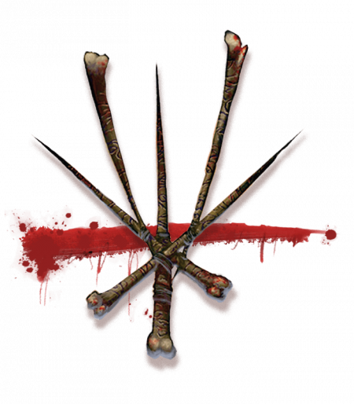

# The Dark Six

The Dark Six are the shadows of the Sovereign Host. These dark gods shape the world and are present at all times, speaking to those willing to hear them. Where the Sovereigns govern positive forces, the Dark Six are the source of fears. Arawai and Balinor reflect the positive aspects of nature. The devastating storm, the earthquake, the wildfire? These are the work of the Devourer.

The Dark Six and the Sovereign Host are opposite sides of the same coin. If you believe in one, you acknowledge the existence of the other. The only question is whether you fear the Six or revere them. Those who choose to follow these sinister deities embrace darkness. A barbarian may thank the Fury for the gift of rage. An assassin walks the path of the Mockery, while a warlock's pact may be a gift of the Shadow.

The Dark Six inspire worship in different ways among diverse cultures. Temples to the Dark Six appear in Droaam, along with wild revels driven by the Fury. The Dark Six aren't worshiped openly elsewhere in Khorvaire; the gods' shrines are hidden, and it's more common to find a cult devoted to a single member of the Six than a temple dedicated to the entire pantheon.

## Symbol

The Hexagram represents the entire pantheon of the Dark Six. The Deities of Eberron table lists the common symbols of the individual gods. However, since the Six aren't worshiped openly in most of Khorvaire, each sect chooses a unique symbol based on the nature of their god. Followers of the Devourer might carry a shark's tooth or a piece of wood scorched in a wildfire. A Keeper cult might use the nine-sided coin of Kol Korran with the face disfigured. A particular sect uses these symbols consistently, if not obviously.

## Rites

The Dark Six are a mirror of the Sovereign Host and their worship uses similar rituals, including formal rituals conducted in song. Each of the Six has their own rites. Followers of the Fury engage in wild revels. Cults of the Devourer gather around enormous bonfires. Cults of the Mockery conduct ritual combats or gather to torture captured enemies.

## Symbol

Temples and shrines of the Dark Six hide behind disguises. A cult of the Mockery might gather in a slaughterhouse, while a shrine to the Shadow remains concealed in the deep stacks of a library. Dedicated temples are built from dark stone, with six doors and the Hexagram engraved in the floor.

## The Six

These common names and attributes describe the Dark Six as they are known in Khorvaire:

- **The Devourer** governs the destructive power of nature, both pure elemental force and savagery in beasts.
- **The Keeper** snatches souls before they can reach Dolurrh and hoards them along with his vast wealth. Those driven by greed call him their patron, and his priests often act as criminal fixers.
- **The Fury** governs both passion and revenge, rage and despair. She offers revenge to those who have been wronged, but her vengeance often leads to suffering.
- **The Mockery** is the patron of treachery and of terror in battle. He guides those who seek victory through guile, both warriors and assassins. He was once the brother of Dol Dorn and Dol Arrah, but he was stripped of his skin and his name after betraying them.
- **The Shadow** is the dark side of knowledge and ambition. It's said to be Aureon's shadow, given malign life when Aureon mastered magic. The Shadow is the maker of monsters and the keeper of forbidden secrets, and it offers malevolent spells to warlocks and wizards.
- **The Traveler** asserts that chaos drives evolution and that change makes us stronger. The Traveler is a trickster and the giver of dangerous gifts. Some artificers worship the Traveler, seeing it as the lord of innovation, but the gifts of the Traveler always have unexpected consequences.

