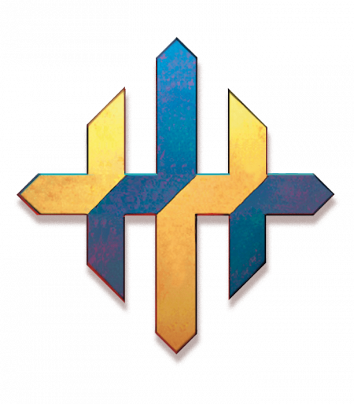

# Sovereign Host

- The Sovereigns are with us at all times. Onatar stands at every forge, and Dol Dorn is with you whenever blades are drawn.
- The Sovereigns shape the world. They offer us guidance and strength, but we must learn to listen.
- Honor every Sovereign in their place and time. If you hear one voice clearly, embrace their path.
- As a follower of the Sovereign Host, you believe that the hand of the Sovereigns can be seen in all things. What others take to be intuition or instinct, you see as the voice of the Sovereigns offering guidance. You don't need absolute proof; the fact of a bountiful harvest is evidence of Arawai's benevolence.

The pantheon of the Sovereign Host embodies all that is good in the world. The people of Khorvaire have followed the Sovereigns for thousands of years, and everyone knows the names of the Sovereigns and the Dark Six. Even people who aren't devout might still swear by the Sovereigns or offer a prayer in a moment of crisis.

The Sovereign Host is wondrously diverse. Variations and subsects of the faith thrive, and temples are only loosely aligned. In a small community, a skilled smith might double as the priest because people believe he's close to Onatar. A midwife might symbolically speak for Arawai and Boldrei. Typically, the faithful are united by their shared beliefs; no central authority seeks to enforce a singular creed.

As a Vassal—a follower of the Sovereign Host—you might feel connection to a particular Sovereign, but still show reverence to each. Your background can influence your particular interpretation of the Sovereigns—the Talenta halflings consider the Sovereigns part of a pantheon of spirits, while some Karrns honor only the Sovereigns of war—but any character can be a Vassal.

## Symbol

The Octagram is the symbol of the Host as a whole. A Sovereign priest either carries a metal Octagram holy symbol or holds a staff tipped with the icon. Priests dedicated to a particular god also display their deity's symbol, and Vassals carry tokens with the symbols of the Sovereigns whose favor they seek. There are eight points in the symbol for eight Sovereigns; the ninth Sovereign (Aureon) is represented by the Octagram itself.

## Rites

Formal prayers to the Sovereigns usually involve song. Specific songs invoke each Sovereign and seek their favor, appreciate the blessings received, and recognize the presence of a Sovereign. Celebrants sing the songs of Boldrei and Aureon at weddings, and soldiers sing Dol Dorn's marching songs on the move and Dol Arrah's hymns on the dawn before a battle.

## Temples

Sovereign shrines arise where people feel the deities are close, such as a library for Aureon or a smithy for Onatar. The rites of Boldrei or Arawai typically occur in the wild, and a tavern could serve as a shrine to Olladra. The shrines can take any form, but they prominently display the symbol of the particular Sovereign.

Temple of the Sovereign Host are made of stone and have eight doors. The walls depict images of the Sovereigns, with the icon of Aureon over the altar and the Octagram engraved on the floor.

## Sovereigns

These common names and attributes describe the nine Sovereigns as they are worshiped in Khorvaire:

- **Arawai** is the Sovereign of Life and Love. She is the patron of fertility and of the benevolent aspects of nature, bringing good harvest and gentle rain.
- **Aureon** is the Sovereign of Law and Lore. He is considered the first wizard, who shared the secrets of wizardry with the world.
- **Balinor** is the Sovereign of Horn and Hunt. He guides both the beast and the hunter, and he is the patron of those who walk on the edge of civilization and the natural world.
- **Boldrei** is the Sovereign of Hall and Hearth. She guides and protects communities and families, inspiring people to work together for the common good.
- **Dol Arrah** is the sun that drives away the darkness. She stands for wisdom in war and for those who fight with honor, pursue justice, and make sacrifices for the greater good.
- **Dol Dorn** is the Sovereign of Strength and Steel. He is the patron of the common soldier, and he guides the hands of anyone who holds a weapon. He embodies courage, strength, and martial skill.
- **Kol Korran** is the Sovereign of World and Wealth. He guards travelers and guides traders. Although the Trickery domain is suggested for his clerics, Kol Korran guides fair negotiation; those driven solely by greed prefer the Keeper of the Dark Six.
- **Olladra** is the Sovereign of Feast and Fortune. She is the giver of joy and the granter of luck, patron to entertainers, gamblers, and anyone who takes a chance.
- **Onatar** is the Sovereign of Fire and Forge. He guides both mundane smiths and artificers, inspiring anyone who performs an act of creation.

