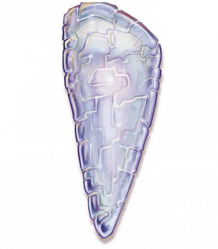

# The Path of the Light

- We live in an age of darkness. We must find the path that leads to the light.
- Act with compassion and courage. Each noble act is a step on the path.
- Hone your body and your mind. You are the tool you will use to change reality.

Practiced by many kalashtar, the Path of Light seeks to change reality by first bringing change within, using meditation to focus the mind and athletic discipline to improve the body. The next step brings light into the world, using courage and compassion to banish the darkness in the people around you. Mediate disputes. Extinguish hatred by guiding people out of darkness. Inspire people to be better than they are. Even the smallest change is a victory, yet lightbringers — the followers of this path — hope that this is merely a step on a greater journey.

The Path of Light teaches that this age is dominated by il-Lashtavar, "the great darkness that dreams." This force poisons the world and promotes darkness. But all things change. If enough light can enter the world, it will lead to a tidal shift: the age of il-Lashtavar will end and usher in the time of il-Yannah, the great light.

Some followers of this faith believe that meditation alone is sufficient to change the path of the world, that merely contemplating the light is sufficient to bring about the change. Most believe that it is necessary to take action, but that darkness must fought with light. Violence is never the answer, and the only way to defeat evil is to redeem it. Lightbringers seek to inspire those who live in fear and enlighten those whose evil is driven by ignorance. The faith has followed this path for over a thousand years, but now a splinter sect advocates greater action. These shadow watchers believe that evil must be fought, that sources of darkness that poison communities can and should be ruthlessly eliminated.

The Path of Light is taught to the kalashtar by the spirits bound to their bloodlines. It is widespread in the nation of Adar in distant Sarlona, but in Khorvaire, it is largely unknown outside kalashtar communities. The shadow watchers champion a sect born in Khorvaire, and the elders of Adar have condemned its methods.

If you follow the Path of Light, you must choose your side. As a lightbringer, you seek to spread hope and goodwill. As a shadow watcher, you hunt down and eliminate sources of darkness. Which path will you follow?

Symbol
The symbol of the Path of Light is a shard of brilliant crystal, carried or worn as an amulet. This crystal may be used as a holy symbol; if it's worn as a necklace, the priest must place one hand on it to use it as a focus. The formal garb of a priest includes a headdress with curving horns and points made from a Sarlonan shell-like material called sentira.

Rites
Physical and mental discipline are important virtues of the Path of Light. Martial arts and guided meditation become a form of devotion and prayer. A kalashtar priest conducts services telepathically, using shrines designed to amplify psychic abilities and allowing them to share thoughts and images directly with the congregation. To an outsider, a service can appear silent and tranquil despite being an ecstatic experience for the faithful.

Temples
The nation of Adar in Sarlona is home to vast fortress monasteries devoted to the Path of Light. In Khorvaire, a mere handful of shrines appear in cities with large kalashtar communities. These shrines are calm and peaceful, the air scented with Sarlonan incense. The chambers are open, providing space for martial arts. Labyrinthine patterns engraved on the floors serve as an aid to meditation, while the walls hold crystals that focus and amplify the psychic abilities of the priests.

