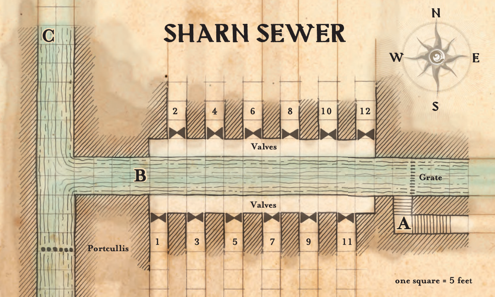
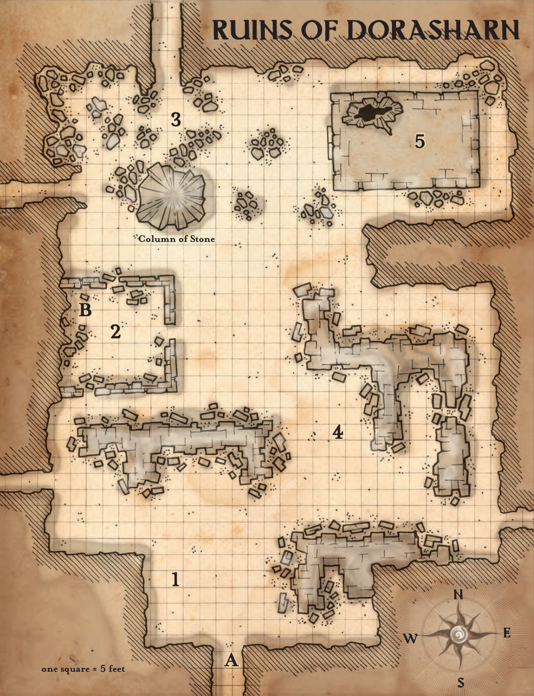

# Chapter 2 - The Forgotten Forge

## Part One - Death in the Upper City

### The Bloody Bridge

- Dalannan Tower in Menthis
- Pouring with rain.

> Curtains of water fall from the sky as you traverse the labyrinthine walkways of Sharn.
> The stone and wooden paths wind around and between the towers and spires high above the ground, forming a complex
> latticework that can be very confusing on evenings such as this.
> The rain falls hard, running off higher walkways and balconies in drenching waves, making it difficult to see much
> more than a few feet ahead of you. The distant glow of everbright lanterns, barely visible in the soaking gloom,
> does little to light the paths on this warm, wet evening.

- DC18 Wisdom (Perception) check to see the body and the figure fleeing over the side of the bridge
- If someone succeeds, read:

> You spot two figures in a dark cloaks moving quietly through the rain on the sky bridge ahead.
> They seem to be avoiding the dim pools of light cast by the everbright lanterns, preferring to stay to the shadows.
> Lightning flashes, and you see a shape on the stone floor of the bridge in the brief illumination.
> The figures quickly reach the railing of the sky bridge, then slip over the barrier and disappears into the
> darkness and the rain.

- As players approach the bridge

> The sky bridge ahead spans the distance between platforms attached to the sides of two different towers — Dalannan
> Tower and the Kelsa Spire.
> A body lies on the floor of the bridge, and you can see a mixture of rain and blood pooling around it.
> A leather satchel, still clutched tightly in the body's hand, lies in the expanding puddle of water and gore.

- The body is that of Bonal Geldem, a professor from Morgrave University
  - DC 10 Wisdom (Medicine) check reveals he is dead, succumbing to large, messy and deep cuts - likely caused by a large weapon.
- Players don't have an opportunity to do much of an investigation just yet, as Cutter and Smasher are about attack from underneath the bridge!
  - DC 15 Wisdom (Perception) check to hear the sound of the Warforged climbing under the bridge.
    - Failure means the character will be surprised.
  - Cutter and Smasher fight with anger against the "meat bags".
  - During the battle, PCs can hear a few shouts from nearby towers:
    - "Hey, stop that!"
    - "Call the Watch!"
    - "Murder! They're murdering that man!"
  - Cutter's final messenger activates if she dies, sending news of her failure to her superior, Sabre.
  - After **4** rounds of combat, if Cutter is still alive, she makes for the satchel and attempts to flee.
- Investigating the body:
  - DC 10 Intelligence (Investigation) check reveals:
    - Identification papers in his pocket:
      - Bonal Geldem, Provost of the School of Pre-Galifar Studies, Morgrave University
    - Coin pouch with 2gp, 10sp
    - Satchel
      - obviously well made and stylish,
      - contains quills and inks,
      - six blank sheets of fine Karrnathi paper,
      - a wrapped apple,
      - Bonal's journal.

> This small journal, measuring about 3 inches by 6 inches and 1 inch thick, has a cover of dark brown leather with
> strands of mithral thread woven in a strange pattern.
> It bears no title, just the mithral-thread icon on the front cover.
> Inside, every page is blank, but the sheets have a strange feel; they don't seem to be paper or leather,
> but something not readily identifiable.

- Players can recognise the pattern on the cover as the same as the old Cannith sigil that they saw at the excavation site.
  - The journal is extremely resistant to damage, including fire.
  - Any attempts to write in the journal using ordinary means fail
    - Ink, charcoal, chalk, and other normal writing mediums simply slide off the blank sheets.
  - The journal radiates a strong aura of Illusion magic.

### The City Watch

> Three guards wearing the green-and-black studded leather of Sharn's City Watch, emerge from the rain-drenched night.
> The leader, a powerfully built bald dwarf with a close-cropped beard, steps forward, leveling his crossbow in your direction.
> The small ball of arcane light, hovering just above and behind his left shoulder, illuminates the area.
> To each side, the two human watch members stand with halberds at the ready.
> "Olladra's bloody nose!" the dwarf curses. "By order of the Watch, drop your weapons and explain yourselves!"

- The city watch shows up a few minutes after combat ends.
  - The officers demand to know what's going on.
    - The lead officer is named Sergeant Dolom.
  - Dolom demands that the adventurers comply with his orders.
    - If they refuse or try to flee, Dolom and his companions attack.
    - They call for additional members of the Watch to hurry to their side.
      - 1d4 members of the Watch show up every 3 rounds until Dolom calls them off or the PCs surrender or are defeated.
  - Players can attempt to explain the situation:
    - DC15 Charisma (Persuasion) check to convince them of their innocence.
      - The players have advantage if they mention the witnesses.
      - The check becomes a DC10 if the players show their Writs from [[Germaine Vilroy]].
      - Beating the DC by 0-5:
        - Dolom accepts that the PCs were trying to help, although he encourages them to leave such matters to the Watch.
      - Beating the DC by 6+:
        - Dolom is impressed with the heroism and bravery displayed by the PCs.
        - He rewards them 2gp each for assisting the Watch and becomes a friendly contact within the Watch.
- After the characters leave the bridge, a cloaked figure approaches them.
  - This Kibbil - the attendant of [[Lady Elaydren Vown d'Cannith]]

### The Broken Anvil

> The sign above the door carries a carving of a shattered anvil, as well as the familiar blink dog emblem of House Ghallanda.
> As you enter the establishment, the inside is warm and welcoming - and much better appointed than you expected given the tavern's location.
> Looking around the place appears to be mostly empty - there's just two patrons, and a halfling woman behind the bar.
> As you enter, you hear the halfling say to the table "My Lady, your guests have arrived"
> The human female in the dark blue cloak has delicate features, dark blue eyes, and sleek black hair bound with silver and turquoise ornaments.
> She wears a signet ring of House Cannith on her right ring finger and speaks in a soft but clear voice.
> "Thank you for coming. We have important business to discuss that relates to the unfortunate death of Bonal Geldem. Please, sit down."

- This is [[Lady Elaydren Vown d'Cannith]], a scion of house Cannith.
  - She greets the PCs, and offers to get the PCs food and drink, but doesn't waste time getting to business:

> I have been working with Provost Geldem to recover a family heirloom. We were to meet earlier tonight, but as you know, he never made it.
> I learned from the Watch what had transpired, and so sent one of my men to track you down.
> The heirloom, according to family legends, was locked away in a foundry that dates back to pre-Galifar Sharn.
> Poor Bonal believed he discovered the location of the foundry in an ancient House Cannith journal.
> I was going to fund an expedition to go to the site, but without Bonal...
> Perhaps you would be willing to recover the heirloom for me. For a generous reward, of course.

- Allow the PCs to ask some questions if they wish:
  - What is the pay?
    - "I offer you **one thousand gold pieces** and the good will of my house if you recover the heirloom and return it to me."
    - A DC15 Charisma (Persuasion) check can convince her to increase this to 1250gp.
    - She will pay the characters 100gp each up front - and offers no more.
  - What is she seeking?
    - "The relic I seek is an adamantine plate in the shape of a seven-pointed star about the size of your hand. It has no special power by itself, but is an ancient schema — a piece of a pattern used by the Cannith artificers of old to craft unusual items."
  - Who killed Bonal Geldem?
    - "A servant of the [[Lord of Blades]]. The warforged prophet wants the schema for his own dark purposes"
    - How do you know it was the [[Lord of Blades]]?
      - "We intercepted an agent of the Lord of Blades attempting to break into a secure House facility. After a certain amount of persuasion, he admitted that he was seeking the lost foundry and who his master was. I would not be surprised if the Lord of Blades has other agents in the city."
  - Who do you work for?
    - "I work for Baron Jorlanna d'Cannith of Aundair, and serve House Cannith West"
    - Why don't you seek the help of the local house?
      - "House Cannith's leadership has been disjointed since the destruction of Cyre. I am loyal to the leader of my portion of the family, which operates out of Aundair. I have nothing against the Sharn-based family, but I am here to further the efforts of Baron Jorlanna d'Cannith of Aundair"
  - Are there any dangers we should be aware of?
    - "Other than the Lord of Blades, who may have other agents seeking the schema, who knows what lurks in the hidden places beneath the city? Now that I think about it, Bonal did say that he would definitely need to bring fire on the expedition. I wonder what he meant? Anyway, I urge caution, but I am completely confident that you can handle anything you may encounter in your search."
    - If the PCs tell her about the final messenger, she looks troubled, then says that the Lord of Blades most definitely is aware of the situation.
- Once the players agree, she asks them for the journal.
  - "The location of the lost foundry is deep within the Dorasharn Tower, 57 levels below the tower's present-day sewer system."
  - "This map shows the way to reach the sewers of the Dorasharn Tower. Somewhere beyond the E-213 Valve Cluster you'll find a sealed door with the same mark as the one on Bonal's journal. Open the seal, and the tunnel beyond will take you to the long-forgotten level far below, where the foundry resides."

#### Secrets

- [[Lady Elaydren Vown d'Cannith]] secretly works for [[Merrix d'Cannith]]
  - She doesn't know why he wants the schema - only that he does
- Elaydren knows that the item they retrieved from Coal is a Docent.
  - She can tell the following facts:
    - It is ancient - hundreds of thousands of years.
    - It was made by the giants of Xen'Drik.
    - Cannith artificers have never been able to replicate it completely.
    - Because of this, they are _incredibly_ rare.
    - It is used in creations such as the Warforged Titans.
  - She will not press the PCs for information about how they got it (for now), as she feels she's already asked a lot of them

## Part Two - Into the Depths

### Malleon's Gate

- The players only know that the entrance is within Dorasharn Tower - they don't know how to find it.
- As they spend some time exploring the streets of Dorasharn:

> The streets of Dorasharn Tower are lined with ramshackle apartments and slums.
> The people are dressed in old, grimy clothes. The merchants sell used and sometimes partially soiled goods.
> This is clearly one of the poorest neighbourhoods in Sharn.
> As you head deeper in the tower, you eventually reach Malleon's Gate.
> The area is filled with goblins, hobgoblins, and the occasional bugbear.
> Sharn has always had goblinoids, but they aren't often seen in numbers like this.
> The area is as busy and chaotic as it is run down.

- Mini-events and sights:
  - An entirely-too-lifelike statue of an angry hobgoblin warrior near the entrance of an apartment.
  - A house Orien coach sits up on bricks - its wheels (and most of its parts) stripped and stolen.
  - A minotaur holding a large piece of wood approaches you and politely asks if you have any copper to spare.
    - He's mildly persistent, but won't hang around if the PCs try to threaten/intimidate him.
  - A small, jovial crowd gathers around a goblin and a kobold that are getting ready to have an arm wrestling match. A bugbear calls for the crowd to place their bets.
    - The match will consist of a best of 3 - roll off 1d20 checks to see who wins.
    - Players can bet. Winners double their money - losers lose it all.
    - If players want to try to influence the result, they have to do it stealthily.
      - Have them roll a DC15 Dexterity (Sleight of Hand or Stealth) check (depending on what they're doing).
      - Failure will result in a bugbear in the crowd noticing their actions, and calling them out.
      - This could lead to a fist fight scuffle!
- Have the players roll Intelligence (Investigation) checks.
  - The highest rolls find just one thing of interest - a stairwell off to the side of the central square.
  - Down the stairs is a small room, about 20x20ft.
  - A goblin named Neebur has setup a tailor shop down here.
    - It's out of the way so he can have some peace and quiet from the chaos of Malleon's Gate.
    - He sells clothes sized and designed for goblins.
      - The clothes are all well made and have their own, distinctive style.
    - If any PC looks hard enough, they notice some _very_ fine (glamerweave) garments.
  - Behind the counter is an old door - the door is rusted and bolted shut.
    - If asked - Neebur will gladly tell the PCs that the door is sealed.
    - If pressed - he will invite them to try and open it if they wish, as long as they don't damage his wares.
    - DC20 Strength check to open the door.
      - The check can be made at advantage with a crowbar.
    - Inside is a foul-smelling cistern.
  - Whilst the PCs are talking to Neebur, they'll hear some heavy footfalls as a well-dressed Bugbear comes down the stairs.
    - This is Mandy - a bully and a brute.
    - A DC 10 Wisdom (Insight) check will reveal Neebur is clearly terrified of him - he stiffens as he sees the bugbear enter.
    - Mandy demands Neebur tells him about his new suits.
      - Neebur hurriedly produces a pair of bugbear-sized trousers from a rack in the corner.
      - Neebur then proceeds to plead for more time, insisting that he needs more than a few hours to craft an entire wardrobe.
    - Mandy will turn to vandalism in an attempt to motivate him.
      - Mandy doesn't care about the presence of the PCs, and will break several racks, unless the PCs intervene.
    - "Yes. I can help you with that Valve issue, but Mandy here is my most important customer. Of course. And I have to take care of him first. I'm sorry, but until he's... done. You'll just have to wait."
  - Neebur doesn't know the location of the valve cluster - but knows someone who will - Skakan.
    - If the PCs stop Mandy - Neebur is all too willing to share this information.
    - If the PCs let Mandy ruin the shop - Neebur will dejectedly share this information, saying that he might as well move his show there himself, now that all he has is trash.

### The Rat's Market

> The tunnels and corridors at this level of the tower are narrow and dark.
> An occasional window slit looks out upon the crowded walls and foundations of other towers, and infrequently placed torches sputter here and there, giving off pallid pools of light and clouds of smoke.
> Even so, rough and dirty people crowd the narrow corridors, and the smell of sweat and sewage permeates the stale air.
> One tunnel opens onto a large chamber, where a mix of goblins, humans, and shifters gather around a small pile of garbage spread across three rotting blankets.
> One of the goblins shouts, "No pushing! No pushing! There's always enough for everyone at the Rat's Market!"
> I've got a rare stick of sealing wax, only partially used, for a mere sixty coppers!
> Or maybe you could use this fine woolen blanket with just a hint of mildew? Only thirty-nine coppers!
> How about a skewer of boiled rat meat? For you, just five silver!

- The rat's market is a small shop run that sell scavenged goods.
- Most of the goods have been found in the sewers and refuse heaps of Sharn, but occasionally a stolen item makes its way into the mix.
  - There's likely little the PCs want to purchase from this assortment of junk.
- The proprietor is a goblin named Skakan.
  - Skakan is the face of a small sewer clan that finds things in the sewers that Skakan then sells to bring in some coin.
  - Skakan will gladly provide directions to the PCs for 100sp.
    - "I could point out the way to a certain valve cluster, but what would it be worth to fine explorers such as yourselves? One hundred silver?"
    - DC15 Charisma (Persuasion) check to reduce the price to 90sp.
    - DC20 Charisma (Persuasion) check to reduce the price to 80sp.
    - If the PCs pay in gold, Skakan's eyes widen, but he does not say anything about it.
    - If the PCs choose to intimidate the information out of him, Skakan will (unhappily) give them the information.
      - He will make sure he gets his revenge later.
- The crowd is made up of goblinoids, humans, and shifters.
  - A couple of the dirtier goblins in the crowd are part of his clan and there to attempt to stir up interest in his goods.
  - A PC not engaged in the conversation with Skakan who surveys the area can make a DC 15 Wisdom (Perception) check to notice a shifter watching them.
    - If one of the PCs notices him - he quickly fades into the crowd and disappears out of one of the many tunnels leading off of this chamber.

### Sharn Sewer

> With each step down, the odor of mold and sewage becomes stronger, and you can hear liquid sounds increasing in volume as you descend.
> There are no lanterns burning, nor windows to let in the sun - it is pitch-black in here.
> Skakan points out a narrow passage that leads to a staircase that descends deeper into the sewers beneath the city.

- Those without darkvision will need a torch to see.

> The stairs lead down to a wider tunnel. A shallow trench, about 2 feet below the tunnel floor, runs down the center of the tunnel.
> To your right is a thick metal grate, spanning wall to wall, and floor to ceiling.
> The trench itself is filled with acrid water, flowing through and away from the grate into the darkness ahead.
> Every few seconds you hear the sound of rushing water, as the valves open and dump more water into the tunnel.

- There is a warforged agent of the [[Lord of Blades]] hiding in an alcove above the stairs.
  - DC18 Wisdom (Perception) check to notice the alcove and him.
  - Once the PCs enter the valve section below, they get ambushed by him.
- There are a pair of Feral Shifters at the other end of the tunnel that attack at the same time.
- Roll Initiative!

> A warforged strikes from the shadows, his rapier piercing the air with deadly efficiency.
> "You have the provost's journal. Give the book to me, and you can live to see another day. Refuse, and we will make your deaths slow and painful."

- The valves go on initiative count 20.
  - Roll 2d6 each round. This determines which valve opens each round.
  - Any creature in line with the valve must make a DC15 Strength save. Failure means they are knocked prone.
- The warforged will try and escape at around 10hp.

### The Door to Yesterday

> A circular metal hatch, set into the tunnel wall and engraved with arcane runes, must be the sealed door that Elaydren told you about.
> In the middle of the hatch, a glowing circle of mithral depicts the same icon as on Bonal's journal — the ancient symbol
> of House Cannith that predates the founding of the Kingdom of Galifar itself, a stylized anvil and hammer.

- The door radiates magic.
  - The only way to open it is to touch the journal to the door.
  - If this is done, the arcane runes radiate with mystic fire and the hatch slides open.
- DC15 Intelligence (Investigation) check reveals small pit marks in the floor and wall near the door.
  - DC20 reveals tiny runes that ebb and flow in intensity and clearly mark the door as trapped.
  - DC20 Arcana reveals the trap to be an ancient warding spell.
- If one of the PCs attempts to damage, force open, or pick the door open - they activate the acid trap.
  - The trap randomly targets up to 3 creatures within 10 feet.
  - Each target must make a DC15 Dexterity saving throw.
    - 2d4 acid damage on failure, half on success.
- Once the PCs open the door, it reveals a vertical shaft that extends above and below.
  - Wind gusts strongly from the lower levels up through the shaft to find its way out somewhere above.
  - There is no ladder, just the pitch black shaft in either direction.
- There is no way to seal the door behind them. The door is designed only to be opened or closed from the outside.
  - If they're creative, the PCs might find a way to block the tunnel off.
  - Consider how this might impede their warforged pursuers.

## The Ruins of Dorasharn

> The vertical shaft is a mix of crumbling earth and ancient stone, and centipedes and other insects cover the walls like living decorations.
> The long descent takes you deeper into the bowels of Dorasharn Tower.
> Soon, the shaft begins to angle, and by bracing yourself you can actually walk along one of the surfaces.
> Farther still, and the shaft becomes a tunnel, and the footing is no longer difficult to maintain or treacherous.
> The tunnel eventually opens onto a vast chamber, though it emerges about six feet above the floor.
> The large chamber rises to a height of 30 feet, but you can't see the distant walls in the darkness.
> The ruins of nearby walls and building appear as deep shadows in the eternal tower night.
> You can feel the change in air currents and pressure that indicate a large open space ahead of you.

- As the PCs walk out into the space, read the following:

> There's a dull sigh that emanates from the walls of this chamber, as you feel a breeze pushing past you.
> The wind carries the dull melody of the cave life - the occasion drip, chittering and squeaking, and the rustling of creatures at home in the dark.
> Some of the sounds occasionally seem to amplify and echo in disturbing ways within this vast underground chamber.

- This chamber is infested with spiders.
  - Just beyond the first set of walls will be some webs - large webs.
  - As the PCs explore they will see all sorts of shadows dance in their torchlight as spiders of all sizes crawl through the darkness.
  - In some places they'll find dusty old skeletons entombed in webbing - picked dry by the spiders.
  - They'll want to watch their step and proceed cautiously.
  - Each time they move forward from an encounter, ask for a Dexterity (Stealth) check.
    - This is an unnecessary role that exists solely to make the PCs think they are specifically hiding from something.
    - This adds a bit of tension to the chamber.
    - The arachnid denizens of this chamber are watching them though, and know where the players are.
    - They will attack at the most dramatic moment in area (4).

> Ahead of you, you can make out an old path leading through the ruins - weaving between the remnants that was once buildings.
> As you walk slowly through the pitch-black ruins, the torchlight casts innumerable shadows all around the party.
> In concert with the background noise, the flickering and dancing shadows almost appear to play tricks on your mind.
> You swear you see something moving, only to look over and just see more ruined stonework.

### Ruined Buildings Choked With Webs (4)

> Proceeding deeper into the chamber, ahead of you looms a set of ruined buildings that are somewhat intact.
> As you inspect a bit closer, you see the ruins appear to be held together and choked by a mass of webs.
> Looking deeper into the chamber, it appears this entire chamber is coated with them.

- If the PCs decide to explore these specific ruins, they can easily happen upon some skeletons encased in webs.

> As you push deeper into these buildings, you find a set of skeletons coated in webs.
> A set of long dead humanoids - in the torchlight their belongings appear to be somewhat intact.

- If the PCs decide to somehow get through the webbing into the bodies.
  - 24 cp, 30 sp, 50 gp,
  - A handful of gems worth 50gp.
  - Two rusted and dulled swords.
  - A dry and brittle wooden staff.
  - Dusty and ruined robes.

> The skeletons do not protest as you jostle them and inspect their pockets and pouches.
> Most of their gear appears to be ancient and in a bad state - rusted, threadbare, and ruined.
> Amongst their pouches you do find a handful of gems and some ancient coins with marked in a way you don't recognise.

- Whilst the PCs explore this area, they will be attacked by two swarms of spiders and a giant spider.

### Ruined Temple (2)

> The outer walls of this building suggests that it was once a temple of some kind.
> Built into the broken and ruined columns and rubble, you see various symbols wrought into the masonry.
> Though somewhat different to today's iconography - you recognise these as the symbols of Onatar, the Sovereign of artifice and the forge.
> Even in its ruined state, with its roof partially caved in - this place still has a quiet, serene feel about it.

- This place is safe from whatever beasts and creatures roam about these dark caverns.
- DC20 Intelligence (Investigation) check will reveal an intact font buried beneath the rubble
  - The font contains a clear and clean liquid.
  - This liquid is equivalent to a potion of healing.
  - There is enough for 3 doses.

### House Cannith Foundry (5)

> In the distance you see a building standing tall amongst the rubble.
> This building is remarkably well preserved; its four walls standing some 20ft tall, and resolute in defiance of their age.
> Unlike most of the buildings you're used to in Sharn which are built into the city's towers - this stands freely and unattached.
> A pair of dark metal doors seal away the insides of the building, and inlaid into them you see the now familiar ancient icon of house Cannith.

- The building is almost completely undamaged, save for the hole in the roof.
- The adamantine doors are locked and all but impervious to damage.
  - A DC15 lock picking check can be used to open the doors.
- There is a hole in the roof which can be used to gain access as well.
  - The walls are easy to climb (DC8 Strength (Athletics) check), and characters can have advantage if thrown a rope.

> A large chunk of the ceiling has fallen in, crushing cabinets and shelves beneath the weight of brick and stone.
> The remains of what appears to be a metal dog that was also caught in the falling stones juts from the debris.
> A set of dusty shelves line the southern wall, and a huge forge and furnace fill the eastern part of the room.
> Neither appears to have been used in centuries.
> Two pairs of glowing eyes emerge from the far darkness, and you see two metal dogs creeping cautiously toward you.

- Two iron defenders guard the foundry.
  - They will not attack the character with the journal, nor will they attack a PC with the mark of making.
  - The player with the journal can attempt to command the defenders to stand down by producing the journal and speaking authoritatively.
    - A DC10 Charisma (Persuasion) check is required as well.
- The room contains the following treasure - some wrapped in oilcloth to protect them from the elements:
  - A suit of mithral scale mail
  - 3 exceptionally crafted shields (worth 20gp each).
  - 1 exceptionally crafted longsword (worth 30gp).
  - 1 exceptionally crafted mace (worth 10gp).
  - 2 sunrods.

### The Vault

- The dog in the rubble has a rod sticking out of its head.
  - (If they're alive) The other two dogs have clear indentations in a similar place.
    - It will take another authoritative command accompanied by a DC12 Charisma (Persuasion) check by the journal's owner to order the dogs to relinquish their rods.
  - (If they're dead) Similar rods are sticking out of the heads of the two iron defenders.

> The huge forge and furnace combination set into the back of the foundry fill 10 square feet of floorspace between them.
> They look like a primitive version of the equipment you'd see in any Cannith shop or enclave.
> Covering the floor around them are metal tiles for an extra 10 feet in each direction.
> Atop the forge you can see three holes evenly spaced.

- Placing the rods into their respective holes will cause some of the floor panels to shift and open up.
  - Inside the small space is the following:
    - 100 sp, 100 gp,
    - 4 gold ingots each worth 50 gp,
    - 3 potions of greater healing,
    - 1 potion of fire resistance,
    - an old map,
      - The old map shows a number of cryptic symbols spread throughout what appears to be ancient depictions of the territory now divided between the Mournland and Darguun.
    - and the schema
      - A dark metal plate shaped into a seven-pointed star.
      - About six inches at its longest dimension.
      - It is covered in strange patterns.
      - It emanates a strong aura of transmutation magic if looked at under detect magic.
      - Identify has no effect on it.

## Endgame

- Saber is the last agent of the lord of blades in Sharn right now.
  - If the PCs slept in the cavern - then he will attack them when they exit the foundry.
  - If they did not, he'll be waiting in the sewers for them.
- Saber will fight until he has 10hp left, and then will attempt to flee.

> A flaming crossbow bolt streaks from the rubble surrounding the large stone column.
> "Weak flesh!" a powerful voice calls out from that direction.
> "Now you face Saber, greatest of the devoted followers of the Lord of Blades.
> Throw down the schema and walk away.
> This day does not have to end with your blood on my hands."

## Conclusion

- The players can return to the Broken Anvil and find Lady Elaydren waiting for them
  - This time she wears a shimmering blue glamerweave gown, and has a powerful looking bodyguard at her side.

> "You have my thanks - and the thanks of my house.
> If you wouldn't mind, I would be honoured if you would agree to assist me further.
> You've proven yourselves more than capable, and I trust that you'd be able to help me find the other pieces.
> There will, of course, be further payment befitting the services you're offering."

- If the PCs accept - she asks for the journal back so that she may study it some more to uncover the next location.
- She will pay the PCs the agreed upon amount - and figure out the nearest messaging station at which she can reach them.
  - The Sivis messaging station at Barmin Tower.
