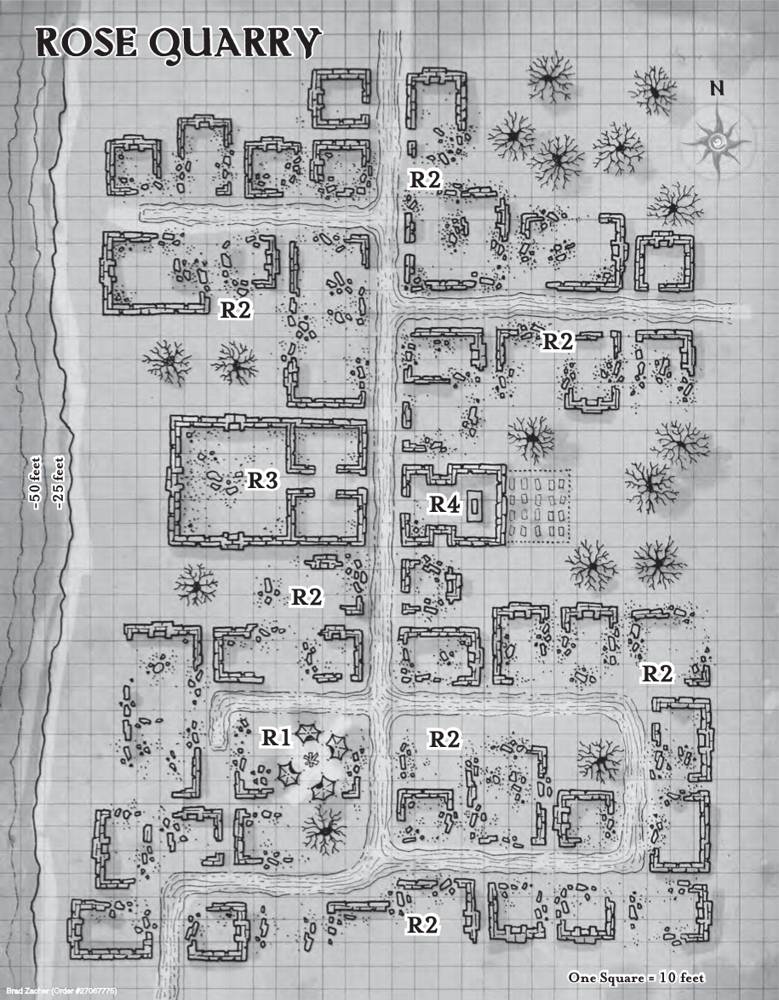

# Part 3 - Rose Quarry

> The elemental bound to the land cart rumbles with a sound like Eberron itself stirring from an ancient sleep.
> The wheels slide partially into the earth itself, and then the land cart slides along without regard to broken ground or other natural obstacles.

- The journey will take the characters a day's travel east along the old trade route towards the ruins of Lyrenton,
  and then two days north east off the beaten track to he quarry.
- If the PCs ask about [[Rose Quarry]], Failin offers the following:

> The village of Rose Quarry belonged to Cyre before the war.
> Now it lies within Darguul territory.
> Originally, House Cannith prospectors established the village when they found a massive vein of red marble.
> Cannith brought in dwarves from the Mror Holds to mine and excavate the marble.
> Anywhere you see Cannith architecture, you may find Rose marble — Sharn, Flamekeep, Korth, even Rhukaan Draal.
> Half the red stone in Khorvaire probably came from the quarry.

- He has little more to add about the town:
  - As a House Cannith outpost, the village was primarily occupied by immigrant dwarves, House Cannith retainers, and a handful of Cyran laborers.
  - Since the quarry was seen as the property of House Cannith, it was largely left alone during the war.
  - The Darguuls have laid claim to all territory extending to the Mournland, but they haven't made any concentrated effort to settle the village.
- The PCs can ask Failin whatever they like, but he doesn't know anything else about Rose Quarry.

## Ambush in the night

- During the first night, the PCs will be ambushed by a party of goblin bandits.
  - 2x Harpy
  - 1x Goblin Boss
  - 4x Goblin
  - 2x Worg
- Roll 1d4 for each watch. On a 4 it occurs, otherwise it occurs on the last watch.
  - DC 14 Wisdom (Perception) check to hear/see the bandits approaching.
- The harpies will use their Luring Song to attempt to charm the PCs.
  - The song has a (slightly modified) DC13 Wisdom saving throw.
- The goblins all have their ears blocked up with wool and dirt, and are thus deafened.
  - The round after the song starts the Worgs, each with a goblin rider, will charge forward to attempt to slap manacles on anyone that's charmed.

## Arrival

> The land cart glides effortlessly over the rugged hilly terrain of the countryside.
> As the cart easily crests another hill, for the first time you get a good look at it in the distance.
> The dead-grey mists.
> A wall of dense, opaque fog stretching from the ground and well into the sky.
> A wall of magic smoke that marks the border of the Mournland.
> Looking at them gives you unsettling feeling deep in pit of your stomach.
> As you stare at them in the far off distance, you swear you see screaming, pained faces slowly rolling through the cloud.
> But as you blink to focus your eyes, you look again and it's just plain old fog.
>
> As twilight starts to descend on Darguun - you crest a hill and laid out in front of you is a vast plateau, bounded to the west by a narrow canyon.
> The quarry extends out for at least a mile, and the nearby village spreads across the plateau - at leas at what's left of it.
> Anything made of wood has been burned to cinders, leaving a handful of stone facades, rock foundations and chimneys behind.
> Strangely, the ruins glisten somewhat in the light of the rising moons.
> Though warm weather surrounds you, the village appears to be covered in a layer of ice.
> As he pulls the cart to a stop atop the crest, Failin gestures towards the ruins: "Were you expecting company?"
> Amongst the glitter, you notice another source of light.
> In the southern part of the village you can make out a fire glowing in a large pit.
> Surrounded by four large tents, you can just make out figures moving around the campsite.

- Wisdom (Perception) Checks:
  - DC15
    - You make out sixteen horses, two covered wagons and seven human-shaped figures.
    - The figures appear to be wearing helmets and chainmail armour, judging by how the firelight reflects off their gear.
    - None of the figures appear to be maintaining a watch.
  - DC20
    - The helmets have a distinctive half-faceplate design
    - Two severely gaunt figures are standing in the shadows. They look like they're keeping watch.
- Passive Perception 14 (or the same for the active check above):
  - In the distance, you can hear a periodic ringing sound, like that of a pick striking stone.
  - The sound appears to be coming from beyond the camp to the North, but you can't see the source of the sound.

- Most of the buildings are rubble, but there are two more or less in-tact buildings:
  - A large building with walls of red marble (R3)
  - A solidly build structure of large grey stone (R4)

## R1 - Emerald Claw Camp

- The Order of the Emerald Claw arrived at Rose Quarry three days ago.
  - Since then, the soldiers of the order have been excavating the village in search of clues to the location of the Whitehearth facility.
- The PCs should definitely _not_ attempt to fight this camp.
  - Make it very clear that there are around 15 bodies total in the camp - they are severely outnumbered.
  - If they are still itching for a fight - make it clear that the guards appear well armed and well trained.
- Sneaking past the camp requires a DC10 Dexterity (Stealth) check.
  - If the check fails by 1-4, they get heard, and a patrol of 3 soldiers and 2 skeletons will investigate
  - If the check fails by 5 or more, they are spotted and Keltis, 5 soldiers and 4 skeletons will pursue them.
- After about 5h (so around midnight), 5 of the soldiers will go to sleep.
  - This will slow the soldier's reaction time by 2 rounds, and the soldiers will be unarmored.
- If the PCs get within 50ft of the camp, read:

> From this spot, you get a clearer view of the camp.
> Six humans are gathered around the fire, and four skeletons armed with scythes stand in silent vigil nearby.
> The humans wear tabards emblazoned with a green claw over chainmail.
> Northwest of the fire, in a clearing between two tents, a man in banded mail clutches an ornate dagger and appears to be chanting or praying.

- Light
  - A large fire blazes in the center of the camp (bright light for 30 feet), while moonlight provides shadowy illumination to the area beyond.
- Sound
  - A successful DC16 Wisdom (Perception) check allows a character to hear prayers being said somewhere in the camp.
  - Anyone who hears the prayers can make a DC 15 Intelligence (Religion) check to identify the chanting as a rite of the Blood of Vol.
- Reaction
  - If anyone in the camp hears suspicious noises, three soldiers and two skeletons are sent to investigate.
  - If anyone in the camp spots the PCs, the cleric, five soldiers, and four skeletons are sent to pursue the intruders, while the remaining soldiers provide ranged weapon support.
- Treasure
  - Keltis carries:
    - 2pp, 8gp, 5sp
    - A potion of healing
    - An ornate dagger with a hilt inlaid with Mabaran ebony and carved with Blood of Vol iconography (worth 100gp)
  - Mallora carries:
    - 3pp, 2gp, 6sp
    - Wand of Magic Missiles
    - Mabaran Ebony Focus
    - Spellshard with the following spells:
      - Ray of Sickness
      - Mage Armor
      - Tasha's Hideous Laughter
      - Disguise Self
      - False Life
      - Ray of Enfeeblement
      - Animate Dead
  - In addition to the goods carried by the individual soldiers, the wagons contain:
    - 1,000 crossbow bolts,
    - 2 light crossbows,
    - 2 morningstars,
    - 2 glaives,
    - assorted picks and tools,
    - 3 vials of unholy water,
    - 30 sunrods,
    - a sack of 20 black onyx gems (worth 25 gp each),
    - a chest containing three 5-pound sacks of silver dust (worth 25 gp each),
    - and a chest containing 500 gp and 100 pp.

## R2 - Molten Glass Ruins

- What the PCs might have mistaken for ice from a distance is actually a thick layer of glass that appears to have been poured (while it was in a molten state) over the entire village.
  - The glass has hardened into interesting shapes and patterns that coat the ruins.
  - Undead creatures similar to zombies wander the ruins, and the PCs must deal with some of them each time they get close to one of the areas marked R2 on the map.
- Out of combat, the glass is difficult terrain, meaning the PCs must move slowly to avoid falling over.
  - In combat, the PCs must move at half speed, or make a DC10 Dexterity (Acrobatics) check each round to move at their full speed.

> A strange layer of glass covers much of the village.
> It coats the ground.
> It cascades from the shattered stone walls.
> Toward the center of the village, one or two buildings appear to be more intact than the rest of the ruins around them.
> Two other sights leap out at you as you look around.
> First, you can see the occasional forms of burned dwarves buried within the glass, their expressions twisted in fear and pain.
> Second, someone has been breaking the glass around some of the ruins, shattering it as though searching for something that may have been trapped within it when the glass cooled and hardened.

- The village of Rose Quarry has been buried under a 1-foot-thick layer of a glass-like substance.
  - This material is tougher than normal glass.
  - The glass is not perfectly smooth, and it can be a precarious surface to traverse.
- The dwarves who were indoors when disaster struck were burned to death in their homes, and charred bones are all that remain of these victims.
  - The corpses on the streets were preserved within the molten glass, their skin charred but their bodies otherwise intact.
- At each location marked R2 on the map, a passive Wisdom (Perception) of 12 will hear the scraping of glass-on-glass.
  - It's difficult to discern the direction of the sounds, due to the weird way the sounds echo throughout the ruins.
  - An active DC18 Wisdom (Perception) check will reveal the direction of the sound.
  - Each location contains 3 Glass Dwarf Ghouls
- If the PCs fight the glass zombies near the camp (the two R2 locations nearest the R1 location), they attract the attention of the soldiers in the camp.
  - Two soldiers of the Emerald Claw arrive in 1d4+1 rounds to investigate the disturbance.

> The screeching sound of glass scraping across glass leads you to a pair of hideous figures.
> Dwarves who died horribly in fire and molten glass now shamble as zombies.
> Unlike ordinary zombies, these undead dwarves are covered in a coating of translucent glass that seems to act as an extra layer of skin.

- Light
  - Moonlight provides shadowy illumination throughout the ruined village.
- Sound
  - A DC 12 Wisdom (Perception) check allows a character to hear the scraping sound of glass sliding across glass as the zombies move about.
  - The PCs can also hear the distant sounds of metal tools striking glass at regular intervals.
  - This sound comes from location R4, but it takes a DC 18 Wisdom (Perception) check to discern the source despite the strange echoes reverberating through the ruins.
- Reaction
  - The strange zombies react with hostility if they see or hear the PCs

## R3 - Cannith Refinery

> This large building, constructed of walls of red marble, has the engraved symbol of an anvil and gorgon carved into the keystone above the arched doorway—the symbol of House Cannith.
> While the outer walls are intact, little else is left of the building.
> The doors and upper floors have been reduced to cinders and rubble.
> Light can be seen glowing from deep inside the building.

- Inside the building are:
  - 4x emerald claw soldier
  - Kaela (military commander)
  - Glass Dwarf Ghoul
- The emerald claw are trying to decipher the map.
  - The dwarf is carting rubble to the entry rooms.

> The large 50-foot-wide chamber has been cleared of most of the rubble and glass you've seen throughout the rest of the village.
> The floor emerges from the shattered glass, formed from red marble and decorated with an embossed design.
> The large chamber contains a few enormous blocks of rough red stone.
> This place was probably where the marble was shaped, polished, and prepared for shipping.
> Large fireplaces occupy the center of the north, south, and west walls, each made of a different type of stone:
>
> - red stone for the north,
> - white stone for the south, and
> - black stone for the west fireplace.
>   Six statues stand around the room, two to each side of one of the fireplaces:
> - A dragon and a lion carved from red marble stand by the north,
> - A wolf and a falcon carved from white marble stand by the south, and
> - An armored knight and a griffon carved from black marble stand by the west.
>   The floor of the chamber features a detailed map of central Khorvaire showing the nations of Aundair, Cyre, Karrnath, Thrane, and Breland.
>   While cities, topographical features, and even major mines are shown in bas relief on the map, no text identifies the locations.

- On the back of the statue's heads are the following carvings:
  - Red Dragon: "Whitehearth, White Seal, NE 9."
  - Red Lion: "Tallis, Black Seal, E 4."
  - White Wolf: "Cabblen Hall, Red Seal, SW 15."
  - White Falcon: "Blackhearth, Black Seal, SE 12."
  - Black Knight: "Kronu Hall, White Seal, N 6."
  - Black Griffon: "Redhearth, Red Seal, SE 7."
- The message indicates the fireplace to start at, the direction and number of paces to walk in.
- The only one that they care about now is Whitehearth:
  - This map reveals that Whitehearth is in a mine approximately thirty miles beyond the gray-mist border of the Mournland, directly due east of the hamlet of Olkhaan.

Area notes:

- Light
  - Sunrods provide bright illumination within the refinery.
- Sound
  - As the PCs approach this location, it becomes clear that it is one source of the sounds of excavation that echo throughout the ruins.
  - A DC 13 Wisdom (Perception) check allows the PCs to hear snippets of conversation between breaks in the chiseling and clearing.
  - A DC 15 Wisdom (Perception) check allows a PC to hear a glass zombie carrying a load of refuse moving from the interior of the building toward the entrance.
- Reaction
  - On noticing intruders, the soldiers draw their weapons and attack.
  - The glass zombie drops the load it carries and attacks upon spotting the PCs.
- Treasure
  - Kaela carries:
    - A potion of healing.
    - +1 shield bearing the symbol of the emerald claw.
    - 12 GP, 5sp
  - DC15 Intelligence (Investigation) check will discover:
    - A casket containing 50pp and a bottle of Oil of Slipperiness labelled Compound 12.

## R4 - Ruined Church

> The structure before you appears to be a church, and you can see symbols of the Sovereign Host carved into the stone walls.
> The roof has fallen in, but the walls appear solid and strong.
> A graveyard sits behind the church, and the sounds of tools striking glass echo from that direction.

- Inside the church:
  - Rubble from the collapsed ceiling fills the interior of the church.
  - The altar can be seen poking up through the debris, but rubble and a coating of glass obscure all other features of the interior area.
  - A DC18 Wisdom (Perception) or DC14 Intelligence (Investigation) check reveals: Oladra's Chalice
- The graveyard out the back:
  - In the graveyard behind the church, the PCs spot four glass dwarf zombies chipping away at the sheets of glass that the red marble gravestones.
  - Four of the graves have already been emptied, and the remains of four dwarves have been piled to one side waiting for Garrow's attention.
  - If Garrow has not been encountered earlier in the adventure, he watches the zombies work from the shadows beneath a glass-coated tree (DC18 Wisdom (Perception) check to see him).

Area notes:

- Light:
  - Moonlight provides shadowy illumination within the ruined church and in the cemetery behind it.
- Sound
  - As the PCs approach this location, it becomes clear that it is a source of the sounds of excavation that echo throughout the ruins.
- Reaction
  - None.
  - No enemy waits within the church, and the zombies working in the cemetery are solely devoted to the task that Garrow has assigned them.
  - Garrow is treated as a separate encounter; he might show up in area R3 after the PCs interpret the map, he might deal with them if they approach the cemetery, or he might appear anywhere else in the village if the PCs draw enough attention to themselves.

## Garrow

- The priest named Garrow commands this Emerald Claw expedition.
- The encounter with Garrow serves as the dramatic capstone of the PCs' exploration of Rose Quarry.
- The PCs can encounter Garrow in a number of different locations.
  - If the PCs make a significant amount of noise while exploring the Cannith refinery, Garrow shows up to investigate the disturbance after the adventurers have had time to unravel the mystery of the map room.
  - If they investigate the sounds coming from behind the ruined church, Garrow emerges from the shadows and greets them.
  - If the adventurers defeat the soldiers in area R3 and solve the riddle of the map room without alerting the rest of the village, Garrow crosses paths with them as they near the edge of the village on their way back to Failin and the land cart.

> A tall, emaciated man, wearing a beautiful hooded robe of black silk, slides out of the shadows.
> He has deathly white skin, and a thick scar runs from the corner of one gleaming red eye back past a pointed ear.
> He smiles, flashing sharp fangs.
> "What have we here?" he hisses, measuring you with a casual glance of his crimson gaze.

- Garrow wants the party to escape:
  - He sends his vulture zombie from area R1 to follow the party and spy on their progress from a discreet distance.

## Escaping From Rose Quarry

- After the encounter with Garrow, the adventurers should have the impression that they need to leave as quickly as possible.
- According to the map, Whitehearth lies thirty miles into the Mournland.
- If the PCs can convince Failin to take them in the land cart, they can reach the location in about 3-1/2 hours.
- It might take more gold, a DC 18 Charisma (Persuasion) check, or both, to convince Failin to brave the dangers of the Mournland.
- Otherwise, the adventurers must travel on foot or steal some of the horses from the Emerald Claw camp.
- Either way, Garrow has his men make a show of chasing the PCs, but he wants them to escape and lead him to the location of Whitehearth.
