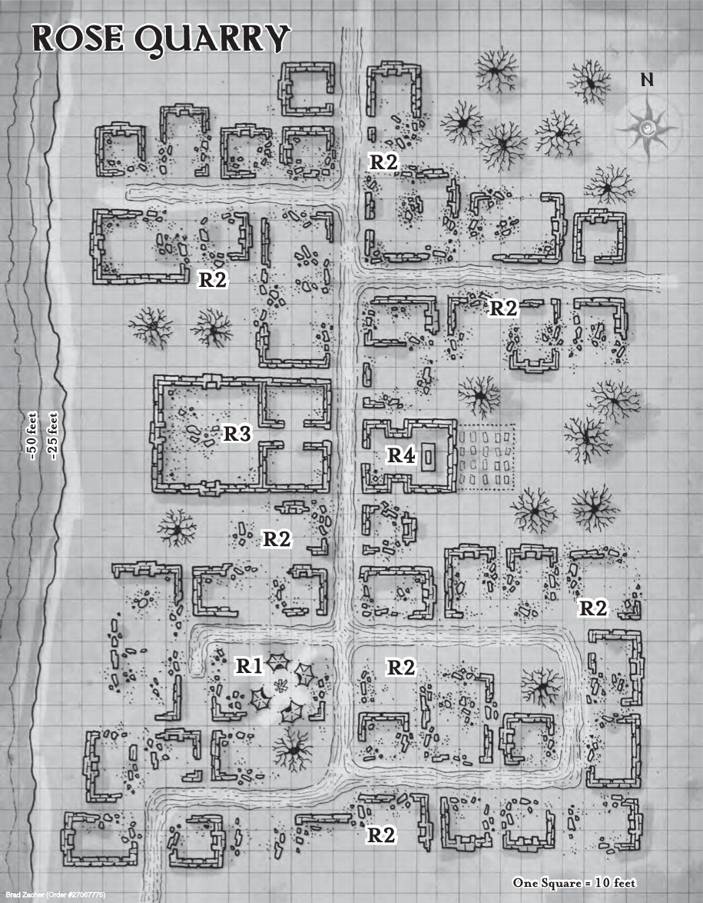

# Chapter 3 - Shadows of the Last War

This chapter starts with some downtime days for the players.
Let them have 4 days of downtime to do with what they wish.

## Part 1 - Sharn

### The Message Station

After the 4th day of downtime - the players head to the message station to check for a message and will find the following:

> Thunder rumbles in the distance as you cross the rain-slick skybridge that leads to Barmin Tower.
> The rain falls at a steady pace, causing waterfalls to spill over the sides of the slanted rooftops and balcony railings.
> Ahead, the door to the House Sivis message station hangs open at a strange angle, one of its hinges separated from the doorframe.
> Lightning flashes, and you think you hear a groan from somewhere inside the otherwise quiet shop.

- Let them approach as they see fit - the scene is completely safe for them, but let them be cautious and alert.
  - When they enter the station, read:

> The tables and stools within the message station are in disarray;
> some are overturned or smashed, others have been forcefully scattered from their usual places.
> Behind the counter, lying atop a spilled shelf of scrolls and parchment sheets, is the gnome clerk who runs the station.
> She moans, unconscious but apparently still alive.

- The gnome clerk is named Jarina Valyre d'Sivis.
  - She can be roused by any healing magic, or will wake on her own after 2 hours.
  - If they choose to rouse her, read:

> The gnome sits up, blinks to clear her eyes, and then attempts to stand.
> She wobbles a little bit but she steadies herself.
> "The messages! I have to check on the messages!"

- The gnome will rush to the back room and check on the messages and the speaking stone.
  - She will find none are missing.
  - She'll also check the till and find it still contains the handful of gold pieces.
  - She knows the following:
    - A band of kobolds charged in and attacked her. There were at least four of the vile creatures.
    - After they subdued her and made sure the place was otherwise empty, a human-sized individual wrapped in a dark cloak entered the shop.
      > "The stranger had a deep, rumbling voice that was strong and threatening, and the kobolds followed his direction without question.
      > He asked if there were any messages for you
      > It was an amazing coincidence, because I had just transcribed a message for you from the speaking stone.
      > I must have glanced at the scroll I was holding, and the next instance the man in the cloak had snatched the scroll
      > with one hand and hit me with the other. That's the last thing I remember."
    - The clerk cannot reveal what the message said - "It isn't really any of my business."
      - House Sivis clerks are trained to transcribe and forget, for their own safety as well as for the privacy of their clients.
      - A DC15 Charisma (Persuasion) check or a small bribe will convince her to reluctantly admit that she remembers the message was from [[Lady Elaydren Vown d'Cannith]].
- Searching the room - Intelligence (Investigation) check:
  - DC 10: The PC notices sling stones scattered around the room.
  - DC 15: The PC spots a series of small, clawed footprints in the spilled ink near one of the overturned tables.
    - The footprints appear to belong to at least two different individuals of the same humanoid species.
    - A successful DC 15 Wisdom (Survival) check or DC 20 Intelligence (Nature) check identifies them as kobold footprints.
  - DC 20: The PC spots a single, larger, split-toed footprint on a sheet of parchment, apparently made when a rain-soaked foot stepped on the parchment sheet.
    - A successful DC 15 Wisdom (Survival) check or DC 20 Intelligence check identifies it as a warforged footprint.

Hopefully at this point, the PCs will want to go check the broken anvil, as it's the last place they met Lady Elaydren.
If it looks like they aren't going to figure it out themselves, the following occurs:

> The rain seems to slack off as you walk away from the message station.
> Around a tower bend, at least a dozen people mill about on a partially covered terrace.
> A gang of children splashes in the puddles near the curving wall, laughing merrily.
> A merchant pushes an empty cart, presumably returning from the market exchange.
> A guard of the Sharn Watch looks the crowd over from his place beneath a shop awning.
> A blur of feathers suddenly rockets toward you out of the cloud-filled sky.
> It's a giant owl, and it circles once before tipping the satchel it carries in its talons to drop a scroll case at your feet.

The message reads:

> Adventurers,
>
> The normal means of communication seems to have been compromised, so I have sent this special messenger to personally find you and deliver this letter.
> Time is short - I feel that our enemies have discovered me and are closing in.
> Meet me at the Broken Anvil tavern, where we first discussed heirlooms and job opportunities.
> Act quickly, for I believe that we are all in terrible danger.
>
> Your patron,
> Lady E.

### The Broken Anvil Redux

> The Broken Anvil is located in the Mason's Tower, carved into a bend in the tower wall.
> Inside, everbright lanterns at either end of the room provide flickering illumination.
> A round table is set to either side of the entrance, and three longer tables are scattered throughout the room.
> Today the Broken Anvil only has one customer, a woman in a worn brown cloak.
> She sits at a table at the far end of the room.
> As you enter, she raises her hand as if to cast a spell, then stops and pulls back her hood.
> Despite her disheveled hair and the dirt that covers her face, you recognize her.
> This is Lady Elaydren d'Cannith, however she looks quite a bit different compared to how you saw her a few days ago.
> Her fine garments have been replaced with mud-splattered, common clothes, and her hair is wet and matted.
> The familiar form of Eranna the innkeeper emerges from the kitchen at the ready, but Elaydren dismisses her with a wave of her hand.
> She beckons you over with another wave and a look of relief on her face.

- Let the players act of their own accord in case they want to say / do something immediately

> "Thank Olladra that you're here. There is no time to waste."
> She lifts a leather backpack off the floor and places it on the table.
> The leather is worn, but its brass fittings are still bright. It appears light and almost empty.
> "There is no time to explain," she says, her fear-filled eyes darting from you to the door and back again.
> "Instructions, gold, and supplies are in this pack. Take it and go.
> The letter in the left-hand pocket explains everything, but you must go now!
> Trust me. If you can accomplish this task, the reward will be vast."

- Give the players a few moments to react and start to ask her questions. Before Elaydren can respond:

> Suddenly the door to the street bursts open.
> Five small figures leap through the doorway — kobolds!
> They move in pairs to each side of the chamber, clearing the space in front of the entrance.
> A fifth figure steps into the doorway, a broad humanoid in a dark, hooded cloak.
> "Give me the schema, and we needn't let this get messy, meat bags."

- Cutlass and his Kobolds fight to the death. It's death or success - there is no failure.
- After combat, Elaydren doesn't remain for long.
- She says the following, picks up a weapon from one of the bodies and rushes out of the door.

> "More of these assassins may show up at any moment.
> All the information you need is in the left pocket of the backpack.
> Take it and go! Get out of the city as quickly as you can!"

- The bag she gave them is a "Heward's Handy Haversack", which contains the following:
  - Center Pocket
    - 80 arrows
    - 80 bolts
    - 50 feet of silk rope
    - 1 bedroll per party member
    - 1 waterskin per party member, filled
    - 3 days trail rations per party member
    - 2 scrolls of Rope Trick
  - Right Pocket
    - 1 everbright lantern
    - 1 flint and steel
    - 1 healer's kit
    - 5 torches
    - 3 sacks
    - Bonal's Journal
  - Left Pocket
    - Letter from Lady Elaydren
    - 3 vials of holy water
    - 3 potions of healing
    - A tiny rod of blue metal, three inches in length, with a sapphire embedded at one end
    - 1 pouch containing 250 pp
    - 1 casket containing 500 gp
- Lady Elaydren's note reads as follows:

> My friends,
> The object you recovered for me from the ruins beneath Sharn is a schema, a piece of a pattern used to create items both mundane and magical.
> I have learned that another schema connected to this pattern was being studied in a secret Cannith workshop in Cyre, called Whitehearth.
> I wonder if this research is tied to the Day of Mourning?
>
> Parts of my own house seek this pattern for evil purposes, and I do not know whom to trust. So I turn to you.
> I need you to travel to Cyre, find the workshop, and recover the second schema.
>
> The location of the workshop was a closely guarded secret lost when the patriarch of House Cannith died in the destruction of Cyre.
> You must travel to the House Cannith outpost in the town of Rose Quarry, in Darguun, to recover a record of all of Cannith's hidden workshops.
>
> In Rhukaan Draal, find a man named Failin in the Bloody Market.
> He can provide you with transport to Rose Quarry.
> From there, travel into the Mournland to find Whitehearth and the second schema.
> It is an adamantine plate in the shape of a diamond, about the size of a human's palm.
> Once you have retrieved it, return to Rhukaan Draal, where I will meet you.
>
> Succeed, and I will see to it that you are well rewarded for your courage.
>
> Lady E.

### Research

- Likely the PCs will want to do some research before departing.
  - Larloch knows that the death of the Cannith leaders and the splintering of the house to be true.
    - If he chooses to do some investigation, a DC 20 Intelligence (Investigation) check can reveal:
      - Whitehearth was a facility in southwestern Cyre.
      - No more information can be found about it.
  - Any form of active research about Darguun will reveal the following:
    - Darguun is well known as the goblin nation that was formally recognized in the Treaty of Thronehold.
    - Rhukaan Draal is the capital and largest city of Darguun.
    - Rhukaan Draal is in central Darguun on the Ghaal River, which empties into Kraken Bay.
    - It is a fairly cosmopolitan trade city where business can be conducted that may not be entirely legal in the Five Nation.
  - Transportation research:
    - There are three ways to get to Rhukaan Draal:
      - By Air:
        - A House Lyrandar Airship.
        - Chartering one will be very expensive - if there is even a captain willing to take them.
        - It will likely cost around 2000gp or more.
        - This will take around 5 days total.
      - By Land:
        - The lighting rail line will get them to Sterngate on the Brelish border to Zilargo.
        - Then by foot or by caravan through Marguul Pass along the Orien trade route will get them to Rhukaan Draal.
        - DC 15 Intelligence (History) check will reveal that Marguul Pass is in the territory of some less-than civilised bugbears.
        - This will cost 250gp each for the lightning rail ticket, and 75gp for the coach ticket (can be discounted with Vlad).
        - This will take around 2 weeks total.
      - By Sea:
        - A House Lyrandar Galleon.
        - There are regular trips leaving from Sharn and heading directly to Rhukaan Draal.
          - Follows the southern coast of the continent before turning inland and traveling up the Ghaal River to reach the city.
        - Depending on who they charter, it could cost anywhere from 500 (for space aboard a trade ship) to 1000gp (for a private vessel).
        - This will take around a week total.

### Get on the Road

- If the PCs stall and do not leave Sharn within a day or so, they will be tailed by members of the Order of the Emerald Claw.
- DC15 Wisdom (Perception) check to notice they are being watched.
  - This will reveal there are 3 individuals on their tail
  - DC20 Wisdom (Perception) check to notice the 4th individual
- One of the agents is clearly better dressed than the others.
  - This is Edvin Garm, an agent of the Order of the Emerald Claw, who will pose as a Karrnathi noble.
  - Garm is charming and clever.
  - If confronted, he will claim that any other members of the Order of the Emerald Claw who have been spotted are his employees and bodyguards.
  - In order to get close to the PCs, he will express interest in an item of value that one of them is visibly carrying, posing as a collector to cover for the fact that he was trailing them.
  - He will, in fact, attempt to buy the item he feigns interest in if the PCs speak to him.
  - He carries 50 gp in a purse and can easily draw on another 750 gp through an account with House Kundarak.
  - If threatened or attacked in public, Garm will maintain his cover, disengage, and shout for the city watch while his three "bodyguards" defend him.
  - If he is attacked where few guards are available, he will 5ght back, but will attempt to escape if possible.

## Part 2 - Darguun

### Sea Travel

- The ship's name is The Dragon's Breath.
- It's captain is a half-elf named Eltarra d'Lyrandar.
- The House Lyrandar galleon leaves from the ports at the base of the Sharn cliffs.
  - It travels from the Hilt into the Straits of Shargon, staying close to the southern coast as it moves from Brelish to Zilargo waters and eventually turns north into Kraken Bay.
  - From there, the elemental-powered vessel enters the Ghaal River for the final leg of the journey to Rhukaan Draal.
- In addition to the adventurers, a dozen traders, travelers, and diplomats are aboard for the trip.
  - Many will disembark when the ship stops briefly in Korranberg, but a handful are scheduled to go all the way to the goblinoid nation's capital.
  - Cargo and trade goods, however, occupy the bulk of space aboard the vessel.
- On the third evening of the voyage, after the ship has entered Kraken Bay.
  - There is a heavy fog rolling through on this night.
  - 4 skeletons, 3 skeleton hobgoblins, and 1 minotaur skeleton will board the ship!
    - They climb aboard with grappling hooks in the dead of night.
  - PCs inside can make a DC15 Wisdom (Perception) check to hear scraping against the hull.
  - PCs on deck can make a DC15 Wisdom (Perception) check to spot the skeletons boarding.
  - On the 2nd round of combat - Eltarra will rally 4 of her crew to fight.
- Eltarra will reward the characters with 50gp each for their aid in defeating the skeletons.
  - She obviously has no idea what sent the skeletons, or why.
  - Their vessel has never before been attacked by anything on this route.

### Land Travel

- The Lightning Rail journey goes off without a hitch. It takes just 3 days to reach Sterngate.
  - The PCs will have to change lines in Starilaskur (this is included in their ticket).
- Sterngate itself is a large stone fortress that guards the pass into Darguun.
  - While it is served by a small village, it is clearly an active military installation.
  - Breland and Darguun are at peace, but there are still bugbear and goblin raiders that pour out of the mountains.
  - Sterngate is Breland's shield against them.
- The PCs can meet up with a caravan leaving from Sterngate within the next day.
  - It's boss - Brect - works for House Orien, but is not dragonmarked.
    - He commands a competent-looking and well-armed crew (including a contingent of House Deneith mercenaries).
    - He will assign the PCs to a wagon toward the rear of the caravan - carrying bolts of glamerweave.
  - If the PCs decide not to travel with the caravan, they will have a much rougher go of making it through to Rhukaan Draal.
    - The near-certainty of bugbear raiders should be impressed upon them.

> "Glad to have adventurers such as yourselves along for this trip," the caravan boss says, slapping one of you on the back.
> "The mountain clans have been acting up lately, and we could use your steel and muscle to make sure all of us make it to Rhukaan Draal in one piece.
> To show my appreciation, I'll give you twenty-five gold apiece when we safely make it to the goblin city."

- A small troop of Brelish soldiers, including two mounted on magebred brown bears, accompany the caravan for the first day and a half as part of their patrol before turning back to Sterngate.
- Beginning on the third day, PCs can make a Wisdom (Perception) check once per day at DC 20 to notice that the caravan is being shadowed.
- The caravan's more experienced members are aware that something is amiss and become nervous.
  - A DC 15 Wisdom (Insight) check will pick up on their discomfort.
- On the seventh day, the caravan will be attacked!
  - The ambushers are hiding and require a DC18 Wisdom (Perception) check to spot.
  - A dozen bugbears and over twice as many goblins attack the caravan.
  - The guards mobilise in its defence. The party will have to deal with 4 goblins, 1 bugbear and 1 bugbear chief.
  - On the second round of combat, the wagon behind the one which the PCs are assigned to will be shrouded in a fog cloud, providing concealment from goblin archers
  - On the third round of combat, a fireball explodes on the hillside farther up the caravan, taking out a large number of the attackers.

### [[Rhukaan Draal]] & The Bloody Market

> It is mid-morning when you finally arrive in Rhukaan Draal.
> Rhukaan Draal is, in many ways, a city of contrasts.
> It has only been inhabited by goblins for the past two decades, having been built around what was once a Cyran frontier town.
> Today it has grown into a sprawling goblinoid metropolis.
> The city appears as a crazy architectural tapestry; mud and timber huts surround ancient structures of stone and brick.
> These buildings are interspersed with a maze of canvas tents and pavilions, built up in every bit of available open space.
> Most of the roads are bare earth, and few of the wonders or conveniences of Sharn are evident here.
> Within this ramshackle city, a single building dominates the skyline — an enormous tower of red stone that rises up from the very center of the city.
> This is Khaar Mbar'ost, the court of the Lhesh Haruuc, the hobgoblin king.
> It is a ten-story structure of red granite built recently by House Cannith artisans to dominate the city's skyline... and it does this quite effectively.
>
> The bulk of the population are goblinoids.
> Timid goblins scurry out of your way while hobgoblins and the occasional band of bugbears swagger about, seeming to dare you to get in their way.
> A few humans the like are scattered throughout the streets – merchants and smugglers looking for goblin gold,
> or fugitives who have fled to Darguun to escape the justice of their homelands.

- The PC's journey to the city will end in the Warehouse district.
- Any of the party's travelling companions can direct them to the Bloody Market, and it's not hard to find.
  - The Bloody Market takes its name from the violent haggling that commonly occurs among the goblinoids, although guards defend merchants if blood is actually shed.
  - An ocean of tents and milling goblins fills the marketplace.
    - The goods are not of the highest quality, but almost anything can be found here, including poisons and other goods usually outlawed in more civilized nations.
- Most of the people in Rhukaan Draal, including the merchants, are unfriendly.
  - For each NPC, get the players to roll 1d6.
    - The players can roll a DC14 Wisdom (Insight) or a DC18 Charisma (Persuasion) check to instead roll 2d6.
    - On a 1 - the NPC directs the PCs to the Clenched Fist - a nearby bar that caters to non-goblins.
    - On a 6 - the NPC directs the PCs to meet with Old Went - a hobgoblin who knows practically all the humans in Rhukaan Draal.
    - On a 2, 3 or 4 - the NPC sends the PCs on a wild goose chase.
- http://dndspeak.com/2018/03/100-market-stalls/

#### Old Went

- Old Went can be found at The Sickly Chicken Inn.
- He is an older Hobgoblin, and is sitting at a table in a shadowy corner of the Inn.
- Years ago, Old Went served as a Deneith mercenary with the Cyrans.
  - He found that he had a knack for languages and getting along well with soldiers of other races.
  - He became the person soldiers would go to in order to send messages or seek out items and substances of dubious legality.
  - After leaving the army, he continued in his newfound career.
  - Now, he is a semi-retired fence who spends his days socializing among the expatriate smugglers and criminals of Rhukaan Draal.
  - He's well-liked in most local circles for his good nature and fair-dealings.
- Old Went knows Failin and will let the PCs know to look for him at the Clenched Fist with a DC 20 Charisma (persuasion) check.
  - He will make it obvious that he expects payment and the DC of the Persuasion check will be reduced by 2 for each 10 gp worth of a bribe he is given.
  - With a bribe of 100 gp or more, no check is needed.
  - If the PCs try to intimidate Old Went, he'll laugh and tell them to find Failin at the Clenched Fist.
    - However, word will quickly get around that the PCs are trouble, and any future dealings they have in Rhukaan Draal will become more far difficult.

#### The Clenched Fist

> From the outside it looks uninviting, broken and ugly.
> Stacked stones and well-crafted wooden beams make up most of the building's outer structure.
> It's hard to see through the high windows, but the uncomfortable atmosphere from within can be felt outside.
>
> The placard above the door displays a mummified ogre's hand clenched tightly in a fist and nailed in place.
>
> As you enter the tavern through the heavy, metallic door, you're welcomed by watching eyes and a horrific scent.
> The bartender is rubbing a glass with a cloth, though it's not getting cleaner and makes no effort to acknowledge your presence.
>
> It's as dire inside as it is on the outside.
> Squared, wooden beams support the upper floor and the light fixtures attached to them.
> The walls are decorated, if you can call it that, with old paintings covered in dust.

- The Clenched Fist is in an old wooden building that has been haphazardly patched several times over.
- The barkeep is Darna, a friendly human woman who wears a wide variety of brightly colored silk scarves.
- The patrons all look various shades of seedy and dangerous - not the type of people you want to encounter in a dark alleyway.
- At one of the tables sits a man, facing the doorway and sipping deeply from a tankard of ale.
  - The PCs can ask around for anyone to point him out.

> A shock of unruly red hair with greying roots frames an weathered, bony face.
> Sunken in their sockets - a pair of dull aquamarine eyes, watch guardedly over the tavern, and eye you off as you approach.
> The man's weathered and lined skin contrasts with his clean, and well-tailored clothing.

- Failin waits for the adventurers to say what they want. He says little, but when he does speak he talks in rapid-fire bursts.
  - Failin is an old human - around 70 years old, though he is surprisingly sprightly.
  - Failing is a Excoriate - a dragonmarked heir that has been stripped of his name and association with the house.
    - One of the keen-eyed PCs will notice the back side of his left forearm is heavily scarred and badly mutilated.
    - Failin will dodge and brush off any question about the scars, saying that it's just the remnants of a job gone wrong.
- If the PCs explain that they want to get to Rose Quarry:

> Rose Quarry? Very far away. Near the border. Near the gray mist. Mining town.
> I can take you. Yes. But it will cost you. Sixty gold each, forty up front.
> You bring your own supplies.

- A DC 15 Charisma (Persuasion) check can reduce the price by one gp per person for each point the result is over 14.
  - If the PC is a member of House Orien and calls upon Failin's loyalties, the check has advantage, but in this case the price will be doubled if the check fails.

#### Bugbear Brawl

> "Let's go, let's go," Failin says, leaping up from the table and gesturing toward the door. "Follow me, quickly! My land cart is hidden nearby."

- On their way to the land cart, Failin and the PCs are interrupted when three bugbears step out of the shadows and confront Failin.

> "Failin, you cheat us!" growls one of the bugbears as both of them raise their morningstars to threatening positions.

- Failin cheated them in their last deal - only delivering half of the goods.
  - The bugbears can be negotiated with, but tensions are high - they're all too willing to beat Failin to a pulp.
  - DC15 Charisma (Persuasion) check

#### The Elemental-Powered Land Cart

> Failin leads you to a large stone outcropping in a secluded area not far from the Bloody Market.
> He rolls up his right sleeve to expose his scarred forearm and steps forward to touch the the stone.
> As he mutters a strange word, you watch as his forearm glows in a strange pattern.
> He steps back as the stone rumbles, and a strange covered wagon emerges from the rock wall.
> The four-wheeled vehicle has a canvas cover that encloses a large rear compartment, while an open bay at the front features a bench and foot well.
> The wagon appears to be made of wood, but an undulating pattern of constantly shifting rock, gem, and crystalline structures seem to overlay the wagon's wooden frame.
> "My land cart," Failin says in a quick burst. "Earth elemental powered. Get in. Time's short. Long road ahead."

- Any PC with experience with dragonmarks can make a DC15 Intelligence (History or Arcana) check to recognise the glyph of the Mark of Passage.
- Any PC that can speak draconic will recognise that he simply said the word "travel".

## Part 3 - Rose Quarry

> The elemental bound to the land cart rumbles with a sound like Eberron itself stirring from an ancient sleep.
> The wheels slide partially into the earth itself, and then the land cart slides along without regard to broken ground or other natural obstacles.

- The journey will take the characters a day's travel east along the old trade route towards the ruins of Lyrenton,
  and then two days north east off the beaten track to he quarry.
- If the PCs ask about [[Rose Quarry]], Failin offers the following:

> The village of Rose Quarry belonged to Cyre before the war.
> Now it lies within Darguul territory.
> Originally, House Cannith prospectors established the village when they found a massive vein of red marble.
> Cannith brought in dwarves from the Mror Holds to mine and excavate the marble.
> Anywhere you see Cannith architecture, you may find Rose marble — Sharn, Flamekeep, Korth, even Rhukaan Draal.
> Half the red stone in Khorvaire probably came from the quarry.

- He has little more to add about the town:
  - As a House Cannith outpost, the village was primarily occupied by immigrant dwarves, House Cannith retainers, and a handful of Cyran laborers.
  - Since the quarry was seen as the property of House Cannith, it was largely left alone during the war.
  - The Darguuls have laid claim to all territory extending to the Mournland, but they haven’t made any concentrated effort to settle the village.
- The PCs can ask Failin whatever they like, but he doesn't know anything else about Rose Quarry.

### Ambush in the night

- During the first night, the PCs will be ambushed by a party of goblin bandits.
  - 2x Harpy
  - 1x Goblin Boss
  - 4x Goblin
  - 2x Worg
- Roll 1d4 for each watch. On a 4 it occurs, otherwise it occurs on the last watch.
  - DC 14 Wisdom (Perception) check to hear/see the bandits approaching.
- The harpies will use their Luring Song to attempt to charm the PCs.
  - The song has a (slightly modified) DC13 Wisdom saving throw.
- The goblins all have their ears blocked up with wool and dirt, and are thus deafened.
  - The round after the song starts the Worgs, each with a goblin rider, will charge forward to attempt to slap manacles on anyone that's charmed.

### Arrival

> The land cart glides effortlessly over the rugged hilly terrain of the countryside.
> As the cart easily crests another hill, for the first time you get a good look at it in the distance.
> The dead-grey mists.
> A wall of dense, opaque fog stretching from the ground and well into the sky.
> A wall of magic smoke that marks the border of the Mournland.
> Looking at them gives you unsettling feeling deep in pit of your stomach.
> As you stare at them in the far off distance, you swear you see screaming, pained faces slowly rolling through the cloud.
> But as you blink to focus your eyes, you look again and it's just plain old fog.
>
> As twilight starts to descend on Darguun - you crest a hill and laid out in front of you is a vast plateau, bounded to the west by a narrow canyon.
> The quarry extends out for at least a mile, and the nearby village spreads across the plateau - at leas at what's left of it.
> Anything made of wood has been burned to cinders, leaving a handful of stone facades, rock foundations and chimneys behind.
> Strangely, the ruins glisten somewhat in the light of the rising moons.
> Though warm weather surrounds you, the village appears to be covered in a layer of ice.
> As he pulls the cart to a stop atop the crest, Failin gestures towards the ruins: "Were you expecting company?"
> Amongst the glitter, you notice another source of light.
> In the southern part of the village you can make out a fire glowing in a large pit.
> Surrounded by four large tents, you can just make out figures moving around the campsite.

- Wisdom (Perception) Checks:
  - DC15
    - You make out sixteen horses, two covered wagons and seven human-shaped figures.
    - The figures appear to be wearing helmets and chainmail armour, judging by how the firelight reflects off their gear.
    - None of the figures appear to be maintaining a watch.
  - DC20
    - The helmets have a distinctive half-faceplate design
    - Two severely gaunt figures are standing in the shadows. They look like they're keeping watch.
- Passive Perception 14 (or the same for the active check above):
  - In the distance, you can hear a periodic ringing sound, like that of a pick striking stone.
  - The sound appears to be coming from beyond the camp to the North, but you can't see the source of the sound.

- Most of the buildings are rubble, but there are two more or less in-tact buildings:
  - A large building with walls of red marble (R3)
  - A solidly build structure of large grey stone (R4)

### R1 - Emerald Claw Camp

- The Order of the Emerald Claw arrived at Rose Quarry three days ago.
  - Since then, the soldiers of the order have been excavating the village in search of clues to the location of the Whitehearth facility.
- The PCs should definitely _not_ attempt to fight this camp.
  - Make it very clear that there are around 15 bodies total in the camp - they are severely outnumbered.
  - If they are still itching for a fight - make it clear that the guards appear well armed and well trained.
- Sneaking past the camp requires a DC10 Dexterity (Stealth) check.
  - If the check fails by 1-4, they get heard, and a patrol of 3 soldiers and 2 skeletons will investigate
  - If the check fails by 5 or more, they are spotted and Keltis, 5 soldiers and 4 skeletons will pursue them.
- After about 5h (so around midnight), 5 of the soldiers will go to sleep.
  - This will slow the soldier's reaction time by 2 rounds, and the soldiers will be unarmored.
- If the PCs get within 50ft of the camp, read:

> From this spot, you get a clearer view of the camp.
> Six humans are gathered around the fire, and four skeletons armed with scythes stand in silent vigil nearby.
> The humans wear tabards emblazoned with a green claw over chainmail.
> Northwest of the fire, in a clearing between two tents, a man in banded mail clutches an ornate dagger and appears to be chanting or praying.

- Light
  - A large fire blazes in the center of the camp (bright light for 30 feet), while moonlight provides shadowy illumination to the area beyond.
- Sound
  - A successful DC16 Wisdom (Perception) check allows a character to hear prayers being said somewhere in the camp.
  - Anyone who hears the prayers can make a DC 15 Intelligence (Religion) check to identify the chanting as a rite of the Blood of Vol.
- Reaction
  - If anyone in the camp hears suspicious noises, three soldiers and two skeletons are sent to investigate.
  - If anyone in the camp spots the PCs, the cleric, five soldiers, and four skeletons are sent to pursue the intruders, while the remaining soldiers provide ranged weapon support.
- Treasure
  - Keltis carries:
    - 2pp, 8gp, 5sp
    - A potion of healing
    - An ornate dagger with a hilt inlaid with Mabaran ebony and carved with Blood of Vol iconography (worth 100gp)
  - Mallora carries:
    - 3pp, 2gp, 6sp
    - Wand of Magic Missiles
    - Mabaran Ebony Focus
    - Spellshard with the following spells:
      - Ray of Sickness
      - Mage Armor
      - Tasha's Hideous Laughter
      - Disguise Self
      - False Life
      - Ray of Enfeeblement
      - Animate Dead
  - In addition to the goods carried by the individual soldiers, the wagons contain:
    - 1,000 crossbow bolts,
    - 2 light crossbows,
    - 2 morningstars,
    - 2 glaives,
    - assorted picks and tools,
    - 3 vials of unholy water,
    - 30 sunrods,
    - a sack of 20 black onyx gems (worth 25 gp each),
    - a chest containing three 5-pound sacks of silver dust (worth 25 gp each),
    - and a chest containing 500 gp and 100 pp.

### R2 - Molten Glass Ruins

- What the PCs might have mistaken for ice from a distance is actually a thick layer of glass that appears to have been poured (while it was in a molten state) over the entire village.
  - The glass has hardened into interesting shapes and patterns that coat the ruins.
  - Undead creatures similar to zombies wander the ruins, and the PCs must deal with some of them each time they get close to one of the areas marked R2 on the map.
- Out of combat, the glass is difficult terrain, meaning the PCs must move slowly to avoid falling over.
  - In combat, the PCs must move at half speed, or make a DC10 Dexterity (Acrobatics) check each round to move at their full speed.

> A strange layer of glass covers much of the village.
> It coats the ground.
> It cascades from the shattered stone walls.
> Toward the center of the village, one or two buildings appear to be more intact than the rest of the ruins around them.
> Two other sights leap out at you as you look around.
> First, you can see the occasional forms of burned dwarves buried within the glass, their expressions twisted in fear and pain.
> Second, someone has been breaking the glass around some of the ruins, shattering it as though searching for something that may have been trapped within it when the glass cooled and hardened.

- The village of Rose Quarry has been buried under a 1-foot-thick layer of a glass-like substance.
  - This material is tougher than normal glass.
  - The glass is not perfectly smooth, and it can be a precarious surface to traverse.
- The dwarves who were indoors when disaster struck were burned to death in their homes, and charred bones are all that remain of these victims.
  - The corpses on the streets were preserved within the molten glass, their skin charred but their bodies otherwise intact.
- At each location marked R2 on the map, a passive Wisdom (Perception) of 12 will hear the scraping of glass-on-glass.
  - It's difficult to discern the direction of the sounds, due to the weird way the sounds echo throughout the ruins.
  - An active DC18 Wisdom (Perception) check will reveal the direction of the sound.
  - Each location contains 3 Glass Dwarf Ghouls
- If the PCs fight the glass zombies near the camp (the two R2 locations nearest the R1 location), they attract the attention of the soldiers in the camp.
  - Two soldiers of the Emerald Claw arrive in 1d4+1 rounds to investigate the disturbance.

> The screeching sound of glass scraping across glass leads you to a pair of hideous figures.
> Dwarves who died horribly in fire and molten glass now shamble as zombies.
> Unlike ordinary zombies, these undead dwarves are covered in a coating of translucent glass that seems to act as an extra layer of skin.

- Light
  - Moonlight provides shadowy illumination throughout the ruined village.
- Sound
  - A DC 12 Wisdom (Perception) check allows a character to hear the scraping sound of glass sliding across glass as the zombies move about.
  - The PCs can also hear the distant sounds of metal tools striking glass at regular intervals.
  - This sound comes from location R4, but it takes a DC 18 Wisdom (Perception) check to discern the source despite the strange echoes reverberating through the ruins.
- Reaction
  - The strange zombies react with hostility if they see or hear the PCs

### R3 - Cannith Refinery

> This large building, constructed of walls of red marble, has the engraved symbol of an anvil and gorgon carved into the keystone above the arched doorway—the symbol of House Cannith.
> While the outer walls are intact, little else is left of the building.
> The roof, doors, and upper floors have been reduced to cinders and rubble.
> Light can be seen glowing from deep inside the building.

- Inside the building are:
  - 4x emerald claw soldier
  - Kaela (military commander)
  - Glass Dwarf Ghoul
- The emerald claw are trying to decipher the map.
  - The dwarf is carting rubble to the entry rooms.

> The large 50-foot-wide chamber has been cleared of most of the rubble and glass you’ve seen throughout the rest of the village.
> The floor emerges from the shattered glass, formed from red marble and decorated with an embossed design.
> The large chamber contains a few enormous blocks of rough red stone.
> This place was probably where the marble was shaped, polished, and prepared for shipping.
> Large fireplaces occupy the center of the north, south, and west walls, each made of a different type of stone:
>
> - red stone for the north,
> - white stone for the south, and
> - black stone for the west fireplace.
>   Six statues stand around the room, two to each side of one of the fireplaces:
> - A dragon and a lion carved from red marble stand by the north,
> - A wolf and a falcon carved from white marble stand by the south, and
> - An armored knight and a griffon carved from black marble stand by the west.
>   The floor of the chamber features a detailed map of central Khorvaire showing the nations of Aundair, Cyre, Karrnath, Thrane, and Breland.
>   While cities, topographical features, and even major mines are shown in bas relief on the map, no text identifies the locations.

- On the back of the statue's heads are the following carvings:
  - Red Dragon: "Whitehearth, White Seal, NE 9."
  - Red Lion: "Tallis, Black Seal, E 4."
  - White Wolf: "Cabblen Hall, Red Seal, SW 15."
  - White Falcon: "Blackhearth, Black Seal, SE 12."
  - Black Knight: "Kronu Hall, White Seal, N 6."
  - Black Griffon: "Redhearth, Red Seal, SE 7."
- The message indicates the fireplace to start at, the direction and number of paces to walk in.
- The only one that they care about now is Whitehearth:
  - This map reveals that Whitehearth is in a mine approximately thirty miles beyond the gray-mist border of the Mournland, directly due east of the hamlet of Olkhaan.

Area notes:

- Light
  - Sunrods provide bright illumination within the refinery.
- Sound
  - As the PCs approach this location, it becomes clear that it is one source of the sounds of excavation that echo throughout the ruins.
  - A DC 13 Wisdom (Perception) check allows the PCs to hear snippets of conversation between breaks in the chiseling and clearing.
  - A DC 15 Wisdom (Perception) check allows a PC to hear a glass zombie carrying a load of refuse moving from the interior of the building toward the entrance.
- Reaction
  - On noticing intruders, the soldiers draw their weapons and attack.
  - The glass zombie drops the load it carries and attacks upon spotting the PCs.
- Treasure
  - Kaela carries:
    - A potion of healing.
    - +1 shield bearing the symbol of the emerald claw.
    - 12 GP, 5sp
  - DC15 Intelligence (Investigation) check will discover:
    - A casket containing 50pp and a bottle of Oil of Slipperiness labelled Compound 12.

### R4 - Ruined Church
