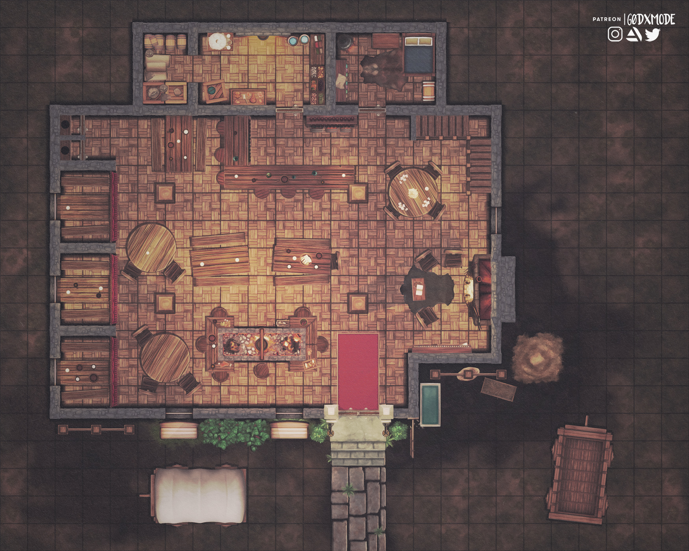

# Chapter 3 - Shadows of the Last War

This chapter starts with some downtime days for the players.
Let them have 4 days of downtime to do with what they wish.

## Part 1 - Sharn

### The Message Station

After the 4th day of downtime - the players head to the message station to check for a message and will find the following:

> Thunder rumbles in the distance as you cross the rain-slick skybridge that leads to Barmin Tower.
> The rain falls at a steady pace, causing waterfalls to spill over the sides of the slanted rooftops and balcony railings.
> Ahead, the door to the House Sivis message station hangs open at a strange angle, one of its hinges separated from the doorframe.
> Lightning flashes, and you think you hear a groan from somewhere inside the otherwise quiet shop.

- Let them approach as they see fit - the scene is completely safe for them, but let them be cautious and alert.
  - When they enter the station, read:

> The tables and stools within the message station are in disarray;
> some are overturned or smashed, others have been forcefully scattered from their usual places.
> Behind the counter, lying atop a spilled shelf of scrolls and parchment sheets, is the gnome clerk who runs the station.
> She moans, unconscious but apparently still alive.

- The gnome clerk is named Jarina Valyre d'Sivis.
  - She can be roused by any healing magic, or will wake on her own after 2 hours.
  - If they choose to rouse her, read:

> The gnome sits up, blinks to clear her eyes, and then attempts to stand.
> She wobbles a little bit but she steadies herself.
> "The messages! I have to check on the messages!"

- The gnome will rush to the back room and check on the messages and the speaking stone.
  - She will find none are missing.
  - She'll also check the till and find it still contains the handful of gold pieces.
  - She knows the following:
    - A band of kobolds charged in and attacked her. There were at least four of the vile creatures.
    - After they subdued her and made sure the place was otherwise empty, a human-sized individual wrapped in a dark cloak entered the shop.
      > "The stranger had a deep, rumbling voice that was strong and threatening, and the kobolds followed his direction without question.
      > He asked if there were any messages for you
      > It was an amazing coincidence, because I had just transcribed a message for you from the speaking stone.
      > I must have glanced at the scroll I was holding, and the next instance the man in the cloak had snatched the scroll
      > with one hand and hit me with the other. That's the last thing I remember."
    - The clerk cannot reveal what the message said - "It isn't really any of my business."
      - House Sivis clerks are trained to transcribe and forget, for their own safety as well as for the privacy of their clients.
      - A DC15 Charisma (Persuasion) check or a small bribe will convince her to reluctantly admit that she remembers the message was from [[Lady Elaydren Vown d'Cannith]].
- Searching the room - Intelligence (Investigation) check:
  - DC 10: The PC notices sling stones scattered around the room.
  - DC 15: The PC spots a series of small, clawed footprints in the spilled ink near one of the overturned tables.
    - The footprints appear to belong to at least two different individuals of the same humanoid species.
    - A successful DC 15 Wisdom (Survival) check or DC 20 Intelligence (Nature) check identifies them as kobold footprints.
  - DC 20: The PC spots a single, larger, split-toed footprint on a sheet of parchment, apparently made when a rain-soaked foot stepped on the parchment sheet.
    - A successful DC 15 Wisdom (Survival) check or DC 20 Intelligence check identifies it as a warforged footprint.

Hopefully at this point, the PCs will want to go check the broken anvil, as it's the last place they met Lady Elaydren.
If it looks like they aren't going to figure it out themselves, the following occurs:

> The rain seems to slack off as you walk away from the message station.
> Around a tower bend, at least a dozen people mill about on a partially covered terrace.
> A gang of children splashes in the puddles near the curving wall, laughing merrily.
> A merchant pushes an empty cart, presumably returning from the market exchange.
> A guard of the Sharn Watch looks the crowd over from his place beneath a shop awning.
> A blur of feathers suddenly rockets toward you out of the cloud-filled sky.
> It's a giant owl, and it circles once before tipping the satchel it carries in its talons to drop a scroll case at your feet.

The message reads:

> Adventurers,
>
> The normal means of communication seems to have been compromised, so I have sent this special messenger to personally find you and deliver this letter.
> Time is short - I feel that our enemies have discovered me and are closing in.
> Meet me at the Broken Anvil tavern, where we first discussed heirlooms and job opportunities.
> Act quickly, for I believe that we are all in terrible danger.
>
> Your patron,
> Lady E.

### The Broken Anvil Redux

> The Broken Anvil is located in the Mason's Tower, carved into a bend in the tower wall.
> Inside, everbright lanterns at either end of the room provide flickering illumination.
> A round table is set to either side of the entrance, and three longer tables are scattered throughout the room.
> Today the Broken Anvil only has one customer, a woman in a worn brown cloak.
> She sits at a table at the far end of the room.
> As you enter, she raises her hand as if to cast a spell, then stops and pulls back her hood.
> Despite her disheveled hair and the dirt that covers her face, you recognize her.
> This is Lady Elaydren d'Cannith, however she looks quite a bit different compared to how you saw her a few days ago.
> Her fine garments have been replaced with mud-splattered, common clothes, and her hair is wet and matted.
> The familiar form of Eranna the innkeeper emerges from the kitchen at the ready, but Elaydren dismisses her with a wave of her hand.
> She beckons you over with another wave and a look of relief on her face.

- Let the players act of their own accord in case they want to say / do something immediately

> "Thank Olladra that you're here. There is no time to waste."
> She lifts a leather backpack off the floor and places it on the table.
> The leather is worn, but its brass fittings are still bright. It appears light and almost empty.
> "There is no time to explain," she says, her fear-filled eyes darting from you to the door and back again.
> "Instructions, gold, and supplies are in this pack. Take it and go.
> The letter in the left-hand pocket explains everything, but you must go now!
> Trust me. If you can accomplish this task, the reward will be vast."

- Give the players a few moments to react and start to ask her questions. Before Elaydren can respond:

> Suddenly the door to the street bursts open.
> Five small figures leap through the doorway — kobolds!
> They move in pairs to each side of the chamber, clearing the space in front of the entrance.
> A fifth figure steps into the doorway, a broad humanoid in a dark, hooded cloak.
> "Give me the schema, and we needn't let this get messy, meat bags."

- Cutlass and his Kobolds fight to the death. It's death or success - there is no failure.
- After combat, Elaydren doesn't remain for long.
- She says the following, picks up a weapon from one of the bodies and rushes out of the door.

> "More of these assassins may show up at any moment.
> All the information you need is in the left pocket of the backpack.
> Take it and go! Get out of the city as quickly as you can!"

- The bag she gave them is a "Heward's Handy Haversack", which contains the following:
  - Center Pocket
    - 80 arrows
    - 80 bolts
    - 50 feet of silk rope
    - 1 bedroll per party member
    - 1 waterskin per party member, filled
    - 3 days trail rations per party member
    - 2 scrolls of Rope Trick
  - Right Pocket
    - 1 everbright lantern
    - 1 flint and steel
    - 1 healer's kit
    - 5 torches
    - 3 sacks
    - Bonal's Journal
  - Left Pocket
    - Letter from Lady Elaydren
    - 3 vials of holy water
    - 3 potions of healing
    - A tiny rod of blue metal, three inches in length, with a sapphire embedded at one end
    - 1 pouch containing 150 pp
    - 1 casket containing 500 gp
- Lady Elaydren's note reads as follows:

> My friends,
> The object you recovered for me from the ruins beneath Sharn is a schema, a piece of a pattern used to create items both mundane and magical.
> I have learned that another schema connected to this pattern was being studied in a secret Cannith workshop in Cyre, called Whitehearth.
> I wonder if this research is tied to the Day of Mourning?
>
> Parts of my own house seek this pattern for evil purposes, and I do not know whom to trust. So I turn to you.
> I need you to travel to Cyre, find the workshop, and recover the second schema.
>
> The location of the workshop was a closely guarded secret lost when the patriarch of House Cannith died in the destruction of Cyre.
> You must travel to the House Cannith outpost in the town of Rose Quarry, in Darguun, to recover a record of all of Cannith's hidden workshops.
>
> In Rhukaan Draal, find a man named Failin in the Bloody Market.
> He can provide you with transport to Rose Quarry.
> From there, travel into the Mournland to find Whitehearth and the second schema.
> It is an adamantine plate in the shape of a diamond, about the size of a human's palm.
> Once you have retrieved it, return to Rhukaan Draal, where I will meet you.
>
> Succeed, and I will see to it that you are well rewarded for your courage.
>
> Lady E.

### Research

- Likely the PCs will want to do some research before departing.
  - Larloch knows that the death of the Cannith leaders and the splintering of the house to be true.
    - If he chooses to do some investigation, a DC 20 Intelligence (Investigation) check can reveal:
      - Whitehearth was a facility in southwestern Cyre.
      - No more information can be found about it.
  - Any form of active research about Darguun will reveal the following:
    - Darguun is well known as the goblin nation that was formally recognized in the Treaty of Thronehold.
    - Rhukaan Draal is the capital and largest city of Darguun.
    - Rhukaan Draal is in central Darguun on the Ghaal River, which empties into Kraken Bay.
    - It is a fairly cosmopolitan trade city where business can be conducted that may not be entirely legal in the Five Nation.
  - Transportation research:
    - There are three ways to get to Rhukaan Draal:
      - By Air:
        - A House Lyrandar Airship.
        - Chartering one will be very expensive - if there is even a captain willing to take them.
        - It will likely cost around 2000gp or more.
        - This will take around 5 days total.
      - By Land:
        - The lighting rail line will get them to Sterngate on the Brelish border to Zilargo.
        - Then by foot or by caravan through Marguul Pass along the Orien trade route will get them to Rhukaan Draal.
        - DC 15 Intelligence (History) check will reveal that Marguul Pass is in the territory of some less-than civilised bugbears.
        - This will cost 250gp for the lightning rail ticket, and 75gp for the coach ticket (can be discounted with Vlad).
        - This will take around 2 weeks total.
      - By Sea:
        - A House Lyrandar Galleon.
        - There are regular trips leaving from Sharn and heading directly to Rhukaan Draal.
          - Follows the southern coast of the continent before turning inland and traveling up the Ghaal River to reach the city.
        - Depending on who they charter, it could cost anywhere from 500 (for space aboard a trade ship) to 1000gp (for a private vessel).
        - This will take around a week total.

### Get on the Road

- If the PCs stall and do not leave Sharn within a day or so, they will be tailed by members of the Order of the Emerald Claw.
- DC15 Wisdom (Perception) check to notice they are being watched.
  - This will reveal there are 3 individuals on their tail
  - DC20 Wisdom (Perception) check to notice the 4th individual
- One of the agents is clearly better dressed than the others.
  - This is Edvin Garm, an agent of the Order of the Emerald Claw, who will pose as a Karrnathi noble.
  - Garm is charming and clever.
  - If confronted, he will claim that any other members of the Order of the Emerald Claw who have been spotted are his employees and bodyguards.
  - In order to get close to the PCs, he will express interest in an item of value that one of them is visibly carrying, posing as a collector to cover for the fact that he was trailing them.
  - He will, in fact, attempt to buy the item he feigns interest in if the PCs speak to him.
  - He carries 50 gp in a purse and can easily draw on another 750 gp through an account with House Kundarak.
  - If threatened or attacked in public, Garm will maintain his cover, disengage, and shout for the city watch while his three "bodyguards" defend him.
  - If he is attacked where few guards are available, he will 5ght back, but will attempt to escape if possible.
