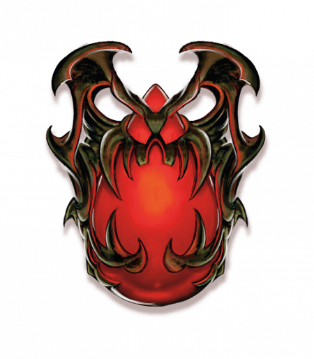

# Blood of Vol

- Everyone has a spark of divinity. Find that power within.
- Death is the end, Dolurrh is oblivion, and if the gods exist, they are cruel. Stand with those you care for; all we have is this life and each other.

What just god would allow death and suffering? The Blood of Vol teaches that we all have the potential to become divine beings—and that death is a curse, designed to kill you before you can unlock the divinity within you.

The Blood of Vol is a grim faith, founded by Erandis d'Vol, an elf from Aerenal. It asserts that death is oblivion, that the universe is uncaring, and that if the Sovereigns exist, they are cruel. Its followers study the secrets of blood and life, and because they believe that death is the end, they see nothing wrong with using the bodies of the fallen to serve the living. Seekers of the Divinity Within (as the faithful call themselves) are glad to be reanimated after death; at least they can do some good.

Because of this association with necromancy, many believe the Blood of Vol embraces death and its followers want to become undead. Both ideas are false. The Blood of Vol sees death as the ultimate evil. Seekers don't want to become undead; they want to become divine beings. The faith teaches that divinity is tied to blood and soul, and the undead can never fully harness that power. The mummies and vampires of the Blood of Vol have sacrificed their chance at divinity to guide the living. They're martyrs, not something to envy.

In addition to a general revulsion toward the undead, the public opinion of the Blood of Vol is colored by the actions of the Order of the Emerald Claw. This extremist sect serves a lich known as the Queen of Death, and it employs necromantic magic in acts of terror. However, most Seekers don't support the Emerald Claw.

The Blood of Vol has its strongest following in Karrnath and the Lhazaar Principalities. For a time, it was the national religion of Karrnath. Though fallen from favor, the faith is still practiced openly in that nation.

## Symbol

The power of a cleric of the Blood of Vol comes from within them. As such, every cleric chooses a unique holy symbol—an object that resonates with them. More generally, the faith is represented by a tear-shaped red gemstone or shard of glass. Priests of the Blood of Vol wear robes of red and black.

## Rites

The services of the Blood of Vol focus on drawing the faithful together as a community and encouraging people to find power within themselves. The most important ritual of the faith is the Sacrament of Blood. After a sermon, each member of the congregation sheds a small amount of blood into a basin. This is a symbol of unity, and a message that members of the community would shed their blood to defend one another. In some temples, this blood is donated to vampire champions of the faith.

## Temples

A shrine devoted to the Blood of Vol requires only an altar and a means for collecting ritually spilled blood. Temples of the Blood of Vol are fortified structures, built to serve as sanctuaries. In contrast to the Silver Flame, such temples are stark and functional. Temples include vaults or catacombs, designed to hold undead or to store corpses.

