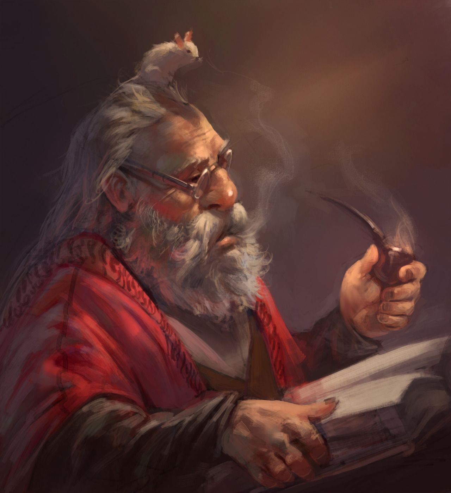

# Griby Gomba

## Story

Griby is from a long line of dwarves hailing from Krujë.

When he was a wee dwarf (~50) his father died and left him a meagre inheritance - some gold, the family home, and a journal.
This journal is said to have been written by his great great grandfather, and contained some secrets encoded within. His father had never been able to decipher them.
Griby was inspired into a life of adventure from this. He sold the family home, and set out to find its meaning.

On his travels, he spent a lot of time in Korçë, where he fell in love with nature and learned druid craft, and learned about nature's cycles of life, death and undeath. After over a hundred years out in nature, he decided to return to his home city, and take up his original quest once more.

The empire kidnapped all the dwarven Forge-Bound...crafting masters that specialize in spellcraft focused around producing a perfect artifact. I never knew one...because city dwarf...but I know they were around before the pacification.

The time I spent in Korçë training in the way of the world, the true way, was educational in many ways. I partly translated the journals given to ME (druidcraft was the key!) and learned that the dwarves were the original denizens of the northernmost regions of the Free Cities.

When the Kingdom of Rhest formed, the elves and the humans fought against the Dwarves, Eventually, the elves and humans prevailed, driving the dwarves out of the most fertile lands into the mountains where they could be safe. Though deprived of their rightful lands and forced to subsist underground the dwarves flourished, and learned to master minerals the elves and humans could never dream of. When once they crafted in stone, now they crafted in adamantite and mithral! They also learned to grow mushrooms, amazing beautiful mushrooms!

A leader arose "The Archon of Stone", he united the wild clans and lit the way to order. He created the Stonestalkers, Druids and Rangers who would scout the way for the legions that would follow the Archon. In the turmoil created by the fall of Rhest and the betrayal of Kalarel the Vile, the Stonestalkers followed their new leader into the west...but not all, some stayed behind to prepare for His return, my grandfather was one of them.

There is more to learn from my grandfather's journals. But I need to learn more to be able to decipher their secrets.

It also seems strange that if this is all dwarven land that dwarves and humans and elves all live pretty much in harmony now...seems like there are some missing bits of info in these journals.

