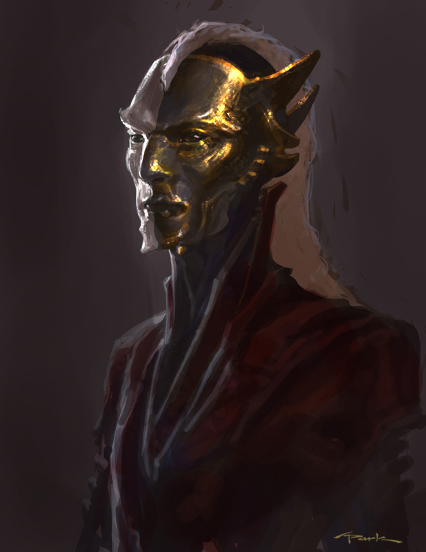

# Session 2 - Monday September 28th 2020

- The crowns are charming magic
  - They made us a lot more complicit to the lies of the dryads.
- Ruined city
- 50ft wide chasm
  - Chasm is filled with still black water
- Chasm encircles ruins entirely
- Fallen tower across the chasm makes a bridge
- Nairo crossed the bridge and was attacked by a unicorn
  - The unicorn said "another group, they sent another group to attack my children"
  - We subdued the unicorn with the bridle
- Hector's owls found unicorns wound out of silver wire
- Tower has grooves cut into it
  - Looks like the wire fits into the grooves
- I cast locate object, and found the gems by the tower.
  - Retha found the gems in a pile of rubble
- When we left the forest, there was a laugh as the green mist encircled the forest once more

---

- When we reentered the city, a guard made a sign as he checked our papers
  - A robed figure darted off at the signal.
  - Nairo tried to catch them, but wasn't able.
  - She left us to talk to her contact.
- **WE WERE GONE FOR WEEKS** #feywild
  - [[Red Cloud]] was killed (murdered) whilst we were away.
  - We can still turn the contract in to the librarians.
- Two criminals (one black, one white) killed each other when we entered the bar.
  - A weird masked dude floated in just after the killing.
  - He put two reddish tinted platinum coins on the bar and said to the bartender "the contract is fulfilled"
  - 
  - The guy picked up the two bodies and floated away.
  - The bartender was not happy about any of this.
  - He's an elf or something?
  - Some guy came into the bar a few weeks ago and paid with reddish tinted platinum.
    - Ever since then, whenever someone dies in the bar, the floating dude comes in and takes the bodies.
- The night market tonight is at the vulgar unicorn.
- Dead dudes had letters on them:
  - One from [[Lynx Creatlach]]
    - Directions to the noble quarter
  - One from [[Sir Ursas]]
    - Directions to the outer circle (pleb area)
  - They each want to meet with us so we can give them the stones...
- We returned the gems to the librarians for our 5000gp reward.
