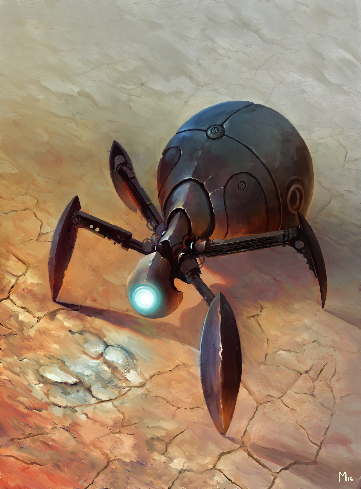

# Session 5 - Monday October 19th 2020

- We gave the gems to the Happy-Joys.
- The next day we got a meeting invite from the Syndicate to talk about future work
- We went to the bazaar and met [[Leylani]]
  - The raven told us the gem is bonded to us
    - They don't know why or how
    - Something we did "put the gems in phase with us"
  - We can use them to find the machine
  - They don't know what the machine is...
  - They want us to go undercover with [[Sir Ursas]] or [[Lynx Creatlach]]
  - They are the [[Red Frog Syndicate]]
- We are at least double crossing [[Lynx Creatlach]]
  - She is giving us a single use item which will let the gems guide us to the location of the machine.
  - We touch the gems to this machine
    
  - It speaks in primordial and infernal
  - It teleported us through space and time
- The robot is now called granny smith
