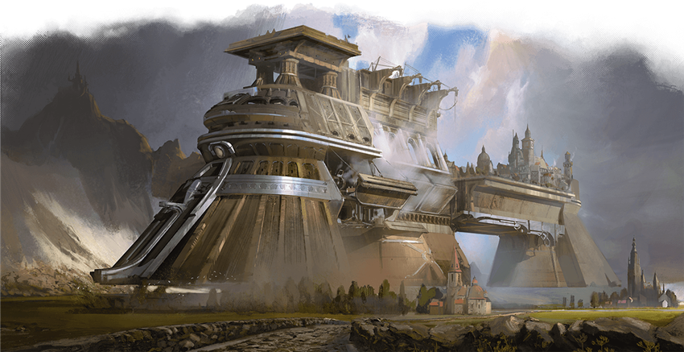

# Argonth

The floating fortress of Breland, Argonth is one of the marvels of the Last War. The product of House Cannith ingenuity and Brelish industrial might, Argonth is the largest engine of war ever built. This moving city is home to thousands of soldiers. Currently Argonth patrols the edge of the Mournland, but if tensions rise with Droaam or Darguun, the fortress can be deployed to reinforce a threatened border.
As a Brelish soldier or spy, you might have served aboard Argonth for a time before some incident led you to become an adventurer.

